# **Impact Analysis**

## **Traceability Graph**
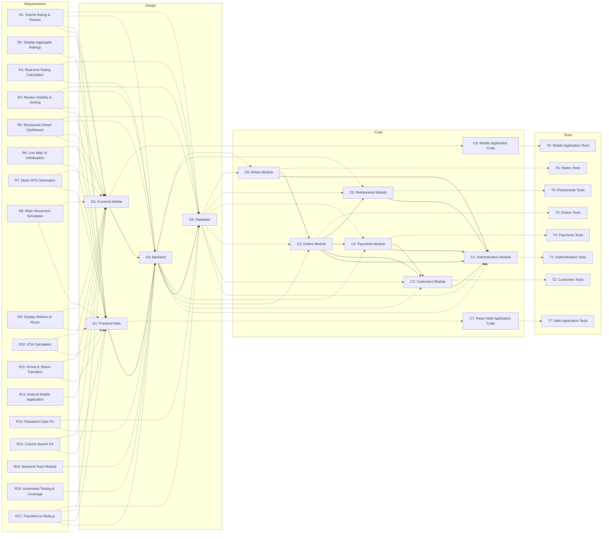
```mermaid
graph LR

%% =====================
%% Requirements
%% =====================
subgraph Requirements
R1[R1: Submit Rating & Review]
R2[R2: Display Aggregate Ratings]
R3[R3: Real-time Rating Calculation]
R4[R4: Review Visibility & Sorting]
R5[R5: Restaurant Owner Dashboard]
R6[R6: Live Map UI Initialization]
R7[R7: Mock GPS Generation]
R8[R8: Rider Movement Simulation]
R9[R9: Display Markers & Route]
R10[R10: ETA Calculation]
R11[R11: Arrival & Status Transition]
R12[R12: Android Mobile Application]
R13[R13: Password Case Fix]
R14[R14: Cuisine Search Fix]
R15[R15: Backend Tests Module]
R16[R16: Automated Testing & Coverage]
R17[R17: Transition to Node.js]
end

%% =====================
%% Design
%% =====================
subgraph Design
D1[D1: Frontend Web]
D2[D2: Frontend Mobile]
D3[D3: Backend]
D4[D4: Database]
end

%% =====================
%% Code Modules
%% =====================
subgraph Code
C1[C1: Authentication Module]
C2[C2: Customers Module]
C3[C3: Orders Module]
C4[C4: Payments Module]
C5[C5: Restaurants Module]
C6[C6: Riders Module]
C7[C7: React Web Application Code]
C8[C8: Mobile Application Code]
end

%% =====================
%% Tests
%% =====================
subgraph Tests
T1[T1: Authentication Tests]
T2[T2: Customers Tests]
T3[T3: Orders Tests]
T4[T4: Payments Tests]
T5[T5: Restaurants Tests]
T6[T6: Riders Tests]
T7[T7: Web Application Tests]
T8[T8: Mobile Application Tests]
end

%% Requirement → Design
R1 -.-> D1
R1 -.-> D2
R1 -.-> D3
R1 -.-> D4
R2 -.-> D1
R2 -.-> D2
R3 -.-> D3
R3 -.-> D4
R4 -.-> D1
R4 -.-> D2
R4 -.-> D3
R4 -.-> D4
R5 -.-> D1
R5 -.-> D2
R5 -.-> D3
R5 -.-> D4
R6 -.-> D1
R6 -.-> D2
R7 -.-> D1
R7 -.-> D2
R8 -.-> D1
R8 -.-> D2
R9 -.-> D1
R9 -.-> D2
R10 -.-> D1
R10 -.-> D2
R11 -.-> D1
R11 -.-> D2
R12 -.-> D2
R13 -.-> D3
R13 -.-> D4
R14 -.-> D1
R14 -.-> D2
R15 -.-> D3
R16 -.-> D3
R17 -.-> D3 
R17 -.-> D1
R17 -.-> D2
R17 -.-> D4 

%% Design --> Design
D1 --> D3
D2 --> D3
D3 --> D4
%% Design → Code
D3 -.-> C1
D3 -.-> C2
D3 -.-> C3
D3 -.-> C4
D3 -.-> C5
D3 -.-> C6

D1 -.-> C7
D2 -.-> C8

D4 -.-> C1
D4 -.-> C2
D4 -.-> C3
D4 -.-> C4
D4 -.-> C5
D4 -.-> C6

%% Code --> Code
C2 --> C1
C3 --> C1
C4 --> C1
C5 --> C1
C6 --> C1

C3 --> C2
C4 --> C2

C6 --> C3

C3 --> C4

C3 --> C5

%% Code → Tests
C1 -.-> T1
C2 -.-> T2
C3 -.-> T3
C4 -.-> T4
C5 -.-> T5
C6 -.-> T6
C7 -.-> T7
C8 -.-> T8
```

## **Traceability Graph (Affected by changes)**
**R1: Submit Rating & Review**
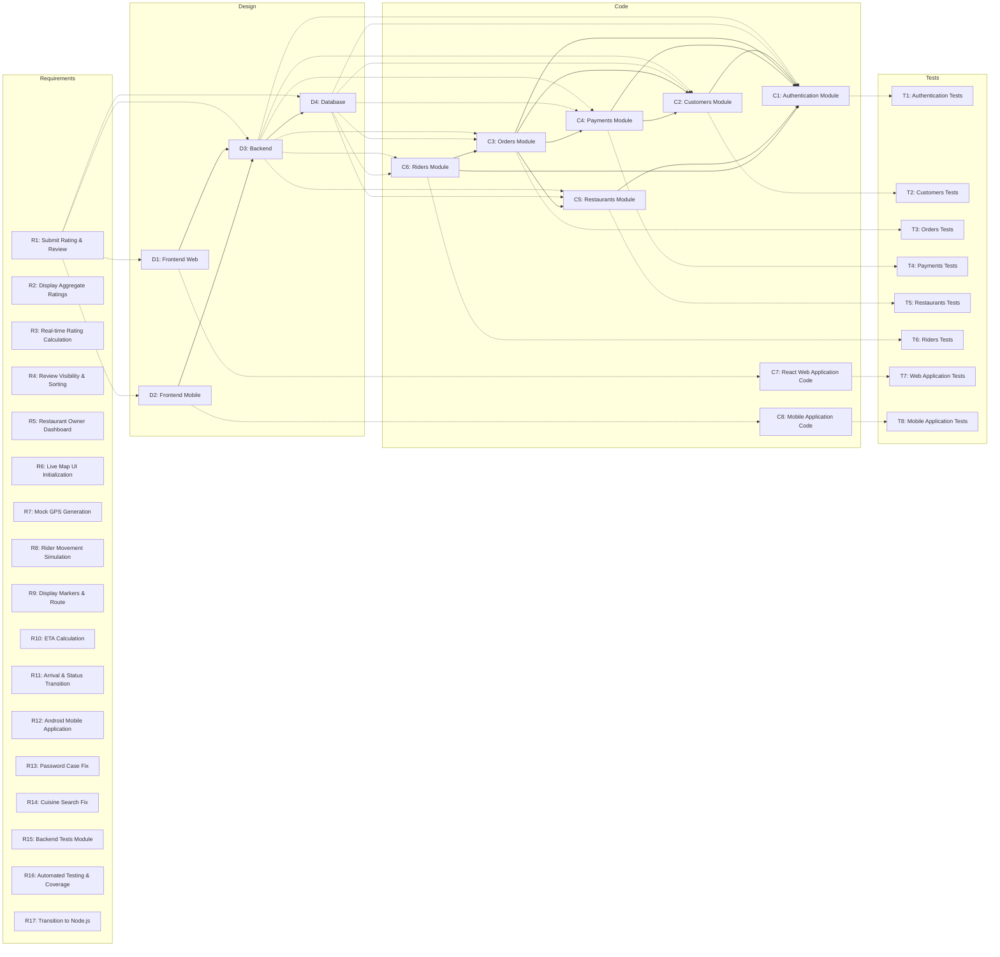
```mermaid
graph LR

%% =====================
%% Requirements
%% =====================
subgraph Requirements
R1[R1: Submit Rating & Review]
R2[R2: Display Aggregate Ratings]
R3[R3: Real-time Rating Calculation]
R4[R4: Review Visibility & Sorting]
R5[R5: Restaurant Owner Dashboard]
R6[R6: Live Map UI Initialization]
R7[R7: Mock GPS Generation]
R8[R8: Rider Movement Simulation]
R9[R9: Display Markers & Route]
R10[R10: ETA Calculation]
R11[R11: Arrival & Status Transition]
R12[R12: Android Mobile Application]
R13[R13: Password Case Fix]
R14[R14: Cuisine Search Fix]
R15[R15: Backend Tests Module]
R16[R16: Automated Testing & Coverage]
R17[R17: Transition to Node.js]
end

%% =====================
%% Design
%% =====================
subgraph Design
D1[D1: Frontend Web]
D2[D2: Frontend Mobile]
D3[D3: Backend]
D4[D4: Database]
end

%% =====================
%% Code Modules
%% =====================
subgraph Code
C1[C1: Authentication Module]
C2[C2: Customers Module]
C3[C3: Orders Module]
C4[C4: Payments Module]
C5[C5: Restaurants Module]
C6[C6: Riders Module]
C7[C7: React Web Application Code]
C8[C8: Mobile Application Code]
end

%% =====================
%% Tests
%% =====================
subgraph Tests
T1[T1: Authentication Tests]
T2[T2: Customers Tests]
T3[T3: Orders Tests]
T4[T4: Payments Tests]
T5[T5: Restaurants Tests]
T6[T6: Riders Tests]
T7[T7: Web Application Tests]
T8[T8: Mobile Application Tests]
end

%% Requirement → Design
R1 -.-> D1
R1 -.-> D2
R1 -.-> D3
R1 -.-> D4
%% R2 -.-> D1
%% R2 -.-> D2
%% R3 -.-> D3
%% R3 -.-> D4
%% R4 -.-> D1
%% R4 -.-> D2
%% R4 -.-> D3
%% R4 -.-> D4
%% R5 -.-> D1
%% R5 -.-> D2
%% R5 -.-> D3
%% R5 -.-> D4
%% R6 -.-> D1
%% R6 -.-> D2
%% R7 -.-> D1
%% R7 -.-> D2
%% R8 -.-> D1
%% R8 -.-> D2
%% R9 -.-> D1
%% R9 -.-> D2
%% R10 -.-> D1
%% R10 -.-> D2
%% R11 -.-> D1
%% R11 -.-> D2
%% R12 -.-> D2
%% R13 -.-> D3
%% R13 -.-> D4
%% R14 -.-> D1
%% R14 -.-> D2
%% R15 -.-> D3
%% R16 -.-> D3
%% R17 -.-> D3 
%% R17 -.-> D1
%% R17 -.-> D2
%% R17 -.-> D4 

%% Design --> Design
D1 --> D3
D2 --> D3
D3 --> D4
%% Design → Code
D3 -.-> C1
D3 -.-> C2
D3 -.-> C3
D3 -.-> C4
D3 -.-> C5
D3 -.-> C6

D1 -.-> C7
D2 -.-> C8

D4 -.-> C1
D4 -.-> C2
D4 -.-> C3
D4 -.-> C4
D4 -.-> C5
D4 -.-> C6

%% Code --> Code
C2 --> C1
C3 --> C1
C4 --> C1
C5 --> C1
C6 --> C1

C3 --> C2
C4 --> C2

C6 --> C3

C3 --> C4

C3 --> C5

%% Code → Tests
C1 -.-> T1
C2 -.-> T2
C3 -.-> T3
C4 -.-> T4
C5 -.-> T5
C6 -.-> T6
C7 -.-> T7
C8 -.-> T8
```

**R2: Submit Rating & Review**
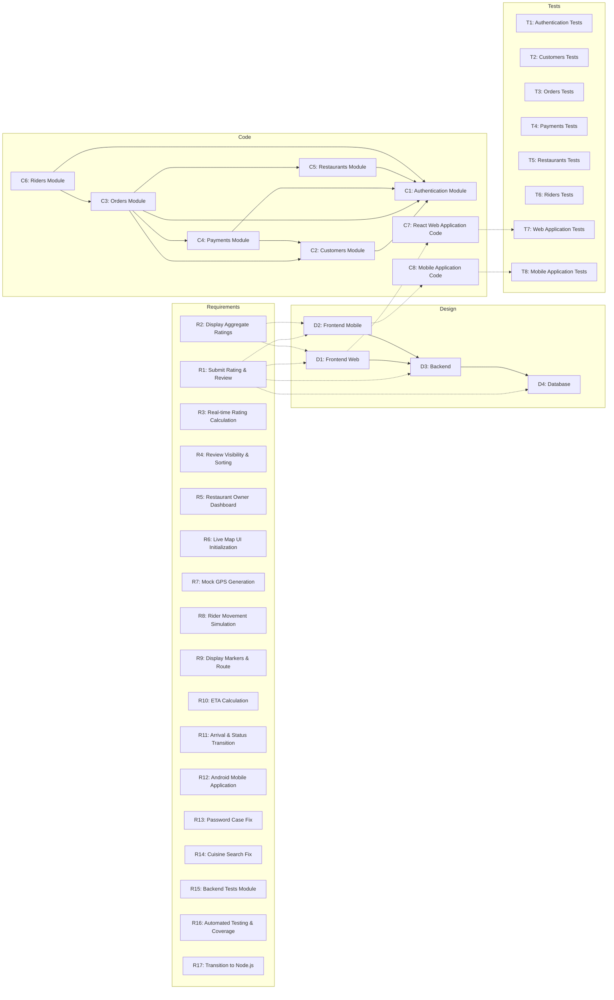
```mermaid
graph LR

%% =====================
%% Requirements
%% =====================
subgraph Requirements
R1[R1: Submit Rating & Review]
R2[R2: Display Aggregate Ratings]
R3[R3: Real-time Rating Calculation]
R4[R4: Review Visibility & Sorting]
R5[R5: Restaurant Owner Dashboard]
R6[R6: Live Map UI Initialization]
R7[R7: Mock GPS Generation]
R8[R8: Rider Movement Simulation]
R9[R9: Display Markers & Route]
R10[R10: ETA Calculation]
R11[R11: Arrival & Status Transition]
R12[R12: Android Mobile Application]
R13[R13: Password Case Fix]
R14[R14: Cuisine Search Fix]
R15[R15: Backend Tests Module]
R16[R16: Automated Testing & Coverage]
R17[R17: Transition to Node.js]
end

%% =====================
%% Design
%% =====================
subgraph Design
D1[D1: Frontend Web]
D2[D2: Frontend Mobile]
D3[D3: Backend]
D4[D4: Database]
end

%% =====================
%% Code Modules
%% =====================
subgraph Code
C1[C1: Authentication Module]
C2[C2: Customers Module]
C3[C3: Orders Module]
C4[C4: Payments Module]
C5[C5: Restaurants Module]
C6[C6: Riders Module]
C7[C7: React Web Application Code]
C8[C8: Mobile Application Code]
end

%% =====================
%% Tests
%% =====================
subgraph Tests
T1[T1: Authentication Tests]
T2[T2: Customers Tests]
T3[T3: Orders Tests]
T4[T4: Payments Tests]
T5[T5: Restaurants Tests]
T6[T6: Riders Tests]
T7[T7: Web Application Tests]
T8[T8: Mobile Application Tests]
end

%% Requirement → Design
R1 -.-> D1
R1 -.-> D2
R1 -.-> D3
R1 -.-> D4
R2 -.-> D1
R2 -.-> D2
%% R3 -.-> D3
%% R3 -.-> D4
%% R4 -.-> D1
%% R4 -.-> D2
%% R4 -.-> D3
%% R4 -.-> D4
%% R5 -.-> D1
%% R5 -.-> D2
%% R5 -.-> D3
%% R5 -.-> D4
%% R6 -.-> D1
%% R6 -.-> D2
%% R7 -.-> D1
%% R7 -.-> D2
%% R8 -.-> D1
%% R8 -.-> D2
%% R9 -.-> D1
%% R9 -.-> D2
%% R10 -.-> D1
%% R10 -.-> D2
%% R11 -.-> D1
%% R11 -.-> D2
%% R12 -.-> D2
%% R13 -.-> D3
%% R13 -.-> D4
%% R14 -.-> D1
%% R14 -.-> D2
%% R15 -.-> D3
%% R16 -.-> D3
%% R17 -.-> D3 
%% R17 -.-> D1
%% R17 -.-> D2
%% R17 -.-> D4 

%% Design --> Design
D1 --> D3
D2 --> D3
D3 --> D4
%% Design → Code
%% D3 -.-> C1
%% D3 -.-> C2
%% D3 -.-> C3
%% D3 -.-> C4
%% D3 -.-> C5
%% D3 -.-> C6

D1 -.-> C7
D2 -.-> C8


%% D4 -.-> C1
%% D4 -.-> C2
%% D4 -.-> C3
%% D4 -.-> C4
%% D4 -.-> C5
%% D4 -.-> C6


%% Code --> Code
C2 --> C1
C3 --> C1
C4 --> C1
C5 --> C1
C6 --> C1

C3 --> C2
C4 --> C2

C6 --> C3

C3 --> C4

C3 --> C5


%% Code → Tests
%% C1 -.-> T1
%% C2 -.-> T2
%% C3 -.-> T3
%% C4 -.-> T4
%% C5 -.-> T5
%% C6 -.-> T6
C7 -.-> T7
C8 -.-> T8
```

**R3: Real-time Rating Calculation**

```mermaid
graph LR

%% =====================
%% Requirements
%% =====================
subgraph Requirements
R1[R1: Submit Rating & Review]
R2[R2: Display Aggregate Ratings]
R3[R3: Real-time Rating Calculation]
R4[R4: Review Visibility & Sorting]
R5[R5: Restaurant Owner Dashboard]
R6[R6: Live Map UI Initialization]
R7[R7: Mock GPS Generation]
R8[R8: Rider Movement Simulation]
R9[R9: Display Markers & Route]
R10[R10: ETA Calculation]
R11[R11: Arrival & Status Transition]
R12[R12: Android Mobile Application]
R13[R13: Password Case Fix]
R14[R14: Cuisine Search Fix]
R15[R15: Backend Tests Module]
R16[R16: Automated Testing & Coverage]
R17[R17: Transition to Node.js]
end

%% =====================
%% Design
%% =====================
subgraph Design
D1[D1: Frontend Web]
D2[D2: Frontend Mobile]
D3[D3: Backend]
D4[D4: Database]
end

%% =====================
%% Code Modules
%% =====================
subgraph Code
C1[C1: Authentication Module]
C2[C2: Customers Module]
C3[C3: Orders Module]
C4[C4: Payments Module]
C5[C5: Restaurants Module]
C6[C6: Riders Module]
C7[C7: React Web Application Code]
C8[C8: Mobile Application Code]
end

%% =====================
%% Tests
%% =====================
subgraph Tests
T1[T1: Authentication Tests]
T2[T2: Customers Tests]
T3[T3: Orders Tests]
T4[T4: Payments Tests]
T5[T5: Restaurants Tests]
T6[T6: Riders Tests]
T7[T7: Web Application Tests]
T8[T8: Mobile Application Tests]
end

%% Requirement → Design
%% R1 -.-> D1
%% R1 -.-> D2
%% R1 -.-> D3
%% R1 -.-> D4
%% R2 -.-> D1
%% R2 -.-> D2
R3 -.-> D3
R3 -.-> D4
%% R4 -.-> D1
%% R4 -.-> D2
%% R4 -.-> D3
%% R4 -.-> D4
%% R5 -.-> D1
%% R5 -.-> D2
%% R5 -.-> D3
%% R5 -.-> D4
%% R6 -.-> D1
%% R6 -.-> D2
%% R7 -.-> D1
%% R7 -.-> D2
%% R8 -.-> D1
%% R8 -.-> D2
%% R9 -.-> D1
%% R9 -.-> D2
%% R10 -.-> D1
%% R10 -.-> D2
%% R11 -.-> D1
%% R11 -.-> D2
%% R12 -.-> D2
%% R13 -.-> D3
%% R13 -.-> D4
%% R14 -.-> D1
%% R14 -.-> D2
%% R15 -.-> D3
%% R16 -.-> D3
%% R17 -.-> D3 
%% R17 -.-> D1
%% R17 -.-> D2
%% R17 -.-> D4 

%% Design --> Design
D1 --> D3
D2 --> D3
D3 --> D4
%% Design → Code
D3 -.-> C1
D3 -.-> C2
D3 -.-> C3
D3 -.-> C4
D3 -.-> C5
D3 -.-> C6

%% D1 -.-> C7
%% D2 -.-> C8


D4 -.-> C1
D4 -.-> C2
D4 -.-> C3
D4 -.-> C4
D4 -.-> C5
D4 -.-> C6


%% Code --> Code
C2 --> C1
C3 --> C1
C4 --> C1
C5 --> C1
C6 --> C1

C3 --> C2
C4 --> C2

C6 --> C3

C3 --> C4

C3 --> C5


%% Code → Tests
C1 -.-> T1
C2 -.-> T2
C3 -.-> T3
C4 -.-> T4
C5 -.-> T5
C6 -.-> T6
%% C7 -.-> T7
%% C8 -.-> T8
```

**R4: Review Visibility & Sorting**
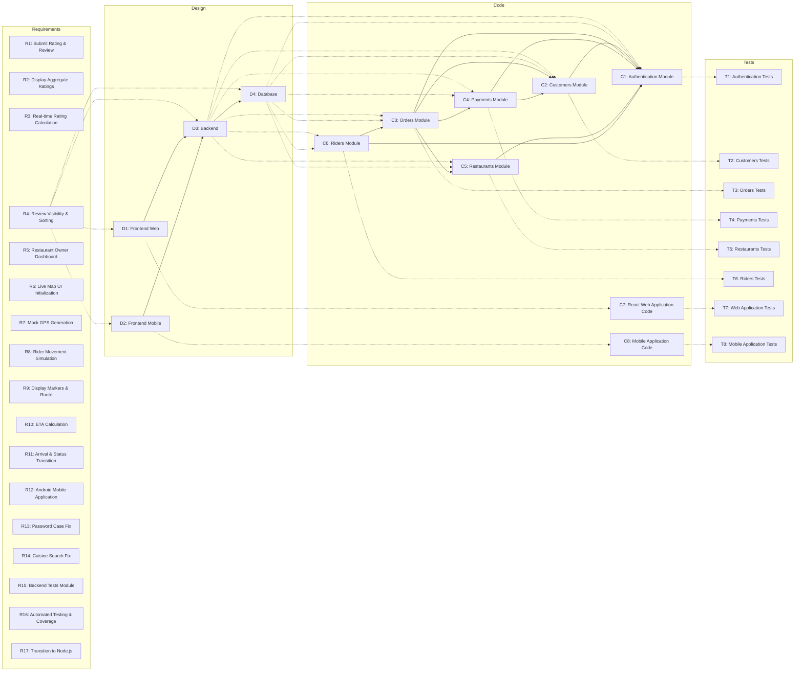
```mermaid
graph LR

%% =====================
%% Requirements
%% =====================
subgraph Requirements
R1[R1: Submit Rating & Review]
R2[R2: Display Aggregate Ratings]
R3[R3: Real-time Rating Calculation]
R4[R4: Review Visibility & Sorting]
R5[R5: Restaurant Owner Dashboard]
R6[R6: Live Map UI Initialization]
R7[R7: Mock GPS Generation]
R8[R8: Rider Movement Simulation]
R9[R9: Display Markers & Route]
R10[R10: ETA Calculation]
R11[R11: Arrival & Status Transition]
R12[R12: Android Mobile Application]
R13[R13: Password Case Fix]
R14[R14: Cuisine Search Fix]
R15[R15: Backend Tests Module]
R16[R16: Automated Testing & Coverage]
R17[R17: Transition to Node.js]
end

%% =====================
%% Design
%% =====================
subgraph Design
D1[D1: Frontend Web]
D2[D2: Frontend Mobile]
D3[D3: Backend]
D4[D4: Database]
end

%% =====================
%% Code Modules
%% =====================
subgraph Code
C1[C1: Authentication Module]
C2[C2: Customers Module]
C3[C3: Orders Module]
C4[C4: Payments Module]
C5[C5: Restaurants Module]
C6[C6: Riders Module]
C7[C7: React Web Application Code]
C8[C8: Mobile Application Code]
end

%% =====================
%% Tests
%% =====================
subgraph Tests
T1[T1: Authentication Tests]
T2[T2: Customers Tests]
T3[T3: Orders Tests]
T4[T4: Payments Tests]
T5[T5: Restaurants Tests]
T6[T6: Riders Tests]
T7[T7: Web Application Tests]
T8[T8: Mobile Application Tests]
end

%% Requirement → Design
%% R1 -.-> D1
%% R1 -.-> D2
%% R1 -.-> D3
%% R1 -.-> D4
%% R2 -.-> D1
%% R2 -.-> D2
%% R3 -.-> D3
%% R3 -.-> D4
R4 -.-> D1
R4 -.-> D2
R4 -.-> D3
R4 -.-> D4
%% R5 -.-> D1
%% R5 -.-> D2
%% R5 -.-> D3
%% R5 -.-> D4
%% R6 -.-> D1
%% R6 -.-> D2
%% R7 -.-> D1
%% R7 -.-> D2
%% R8 -.-> D1
%% R8 -.-> D2
%% R9 -.-> D1
%% R9 -.-> D2
%% R10 -.-> D1
%% R10 -.-> D2
%% R11 -.-> D1
%% R11 -.-> D2
%% R12 -.-> D2
%% R13 -.-> D3
%% R13 -.-> D4
%% R14 -.-> D1
%% R14 -.-> D2
%% R15 -.-> D3
%% R16 -.-> D3
%% R17 -.-> D3 
%% R17 -.-> D1
%% R17 -.-> D2
%% R17 -.-> D4 

%% Design --> Design
D1 --> D3
D2 --> D3
D3 --> D4
%% Design → Code
D3 -.-> C1
D3 -.-> C2
D3 -.-> C3
D3 -.-> C4
D3 -.-> C5
D3 -.-> C6

D1 -.-> C7
D2 -.-> C8


D4 -.-> C1
D4 -.-> C2
D4 -.-> C3
D4 -.-> C4
D4 -.-> C5
D4 -.-> C6


%% Code --> Code
C2 --> C1
C3 --> C1
C4 --> C1
C5 --> C1
C6 --> C1

C3 --> C2
C4 --> C2

C6 --> C3

C3 --> C4

C3 --> C5


%% Code → Tests
C1 -.-> T1
C2 -.-> T2
C3 -.-> T3
C4 -.-> T4
C5 -.-> T5
C6 -.-> T6
C7 -.-> T7
C8 -.-> T8
```

**R5: Restaurant Owner Dashboard**
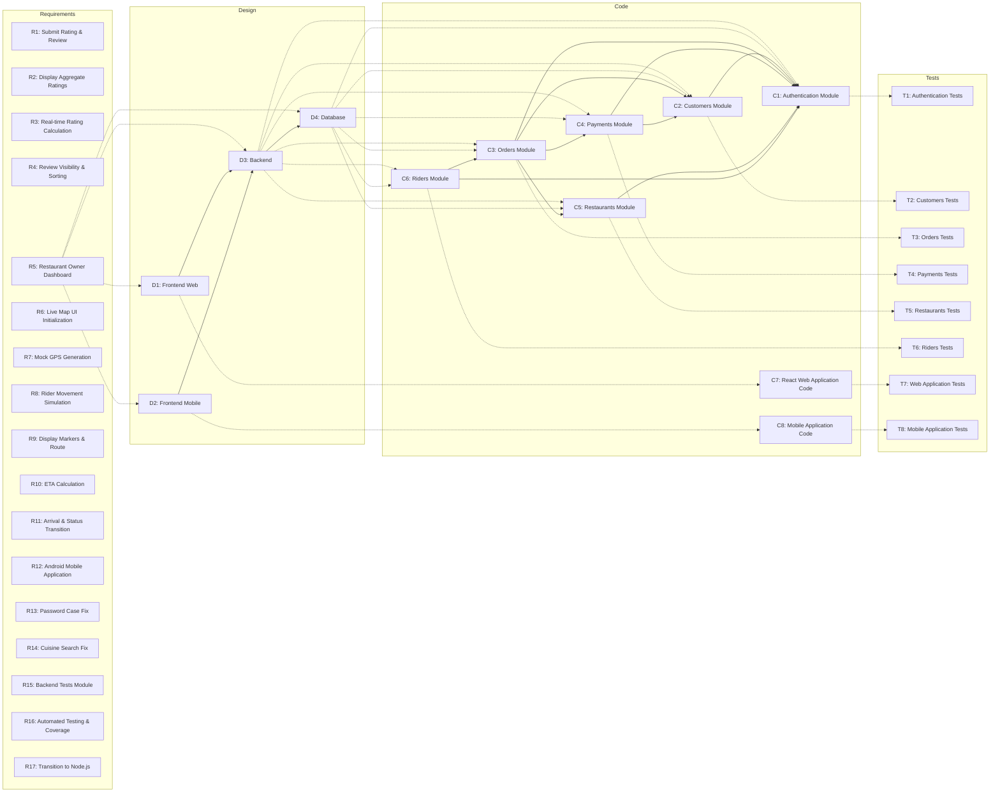
```mermaid
graph LR

%% =====================
%% Requirements
%% =====================
subgraph Requirements
R1[R1: Submit Rating & Review]
R2[R2: Display Aggregate Ratings]
R3[R3: Real-time Rating Calculation]
R4[R4: Review Visibility & Sorting]
R5[R5: Restaurant Owner Dashboard]
R6[R6: Live Map UI Initialization]
R7[R7: Mock GPS Generation]
R8[R8: Rider Movement Simulation]
R9[R9: Display Markers & Route]
R10[R10: ETA Calculation]
R11[R11: Arrival & Status Transition]
R12[R12: Android Mobile Application]
R13[R13: Password Case Fix]
R14[R14: Cuisine Search Fix]
R15[R15: Backend Tests Module]
R16[R16: Automated Testing & Coverage]
R17[R17: Transition to Node.js]
end

%% =====================
%% Design
%% =====================
subgraph Design
D1[D1: Frontend Web]
D2[D2: Frontend Mobile]
D3[D3: Backend]
D4[D4: Database]
end

%% =====================
%% Code Modules
%% =====================
subgraph Code
C1[C1: Authentication Module]
C2[C2: Customers Module]
C3[C3: Orders Module]
C4[C4: Payments Module]
C5[C5: Restaurants Module]
C6[C6: Riders Module]
C7[C7: React Web Application Code]
C8[C8: Mobile Application Code]
end

%% =====================
%% Tests
%% =====================
subgraph Tests
T1[T1: Authentication Tests]
T2[T2: Customers Tests]
T3[T3: Orders Tests]
T4[T4: Payments Tests]
T5[T5: Restaurants Tests]
T6[T6: Riders Tests]
T7[T7: Web Application Tests]
T8[T8: Mobile Application Tests]
end

%% Requirement → Design
%% R1 -.-> D1
%% R1 -.-> D2
%% R1 -.-> D3
%% R1 -.-> D4
%% R2 -.-> D1
%% R2 -.-> D2
%% R3 -.-> D3
%% R3 -.-> D4
%% R4 -.-> D1
%% R4 -.-> D2
%% R4 -.-> D3
%% R4 -.-> D4
R5 -.-> D1
R5 -.-> D2
R5 -.-> D3
R5 -.-> D4
%% R6 -.-> D1
%% R6 -.-> D2
%% R7 -.-> D1
%% R7 -.-> D2
%% R8 -.-> D1
%% R8 -.-> D2
%% R9 -.-> D1
%% R9 -.-> D2
%% R10 -.-> D1
%% R10 -.-> D2
%% R11 -.-> D1
%% R11 -.-> D2
%% R12 -.-> D2
%% R13 -.-> D3
%% R13 -.-> D4
%% R14 -.-> D1
%% R14 -.-> D2
%% R15 -.-> D3
%% R16 -.-> D3
%% R17 -.-> D3 
%% R17 -.-> D1
%% R17 -.-> D2
%% R17 -.-> D4 

%% Design --> Design
D1 --> D3
D2 --> D3
D3 --> D4
%% Design → Code
D3 -.-> C1
D3 -.-> C2
D3 -.-> C3
D3 -.-> C4
D3 -.-> C5
D3 -.-> C6

D1 -.-> C7
D2 -.-> C8


D4 -.-> C1
D4 -.-> C2
D4 -.-> C3
D4 -.-> C4
D4 -.-> C5
D4 -.-> C6


%% Code --> Code
C2 --> C1
C3 --> C1
C4 --> C1
C5 --> C1
C6 --> C1

C3 --> C2
C4 --> C2

C6 --> C3

C3 --> C4

C3 --> C5


%% Code → Tests
C1 -.-> T1
C2 -.-> T2
C3 -.-> T3
C4 -.-> T4
C5 -.-> T5
C6 -.-> T6
C7 -.-> T7
C8 -.-> T8
```

**R6: Live Map UI Initialization**
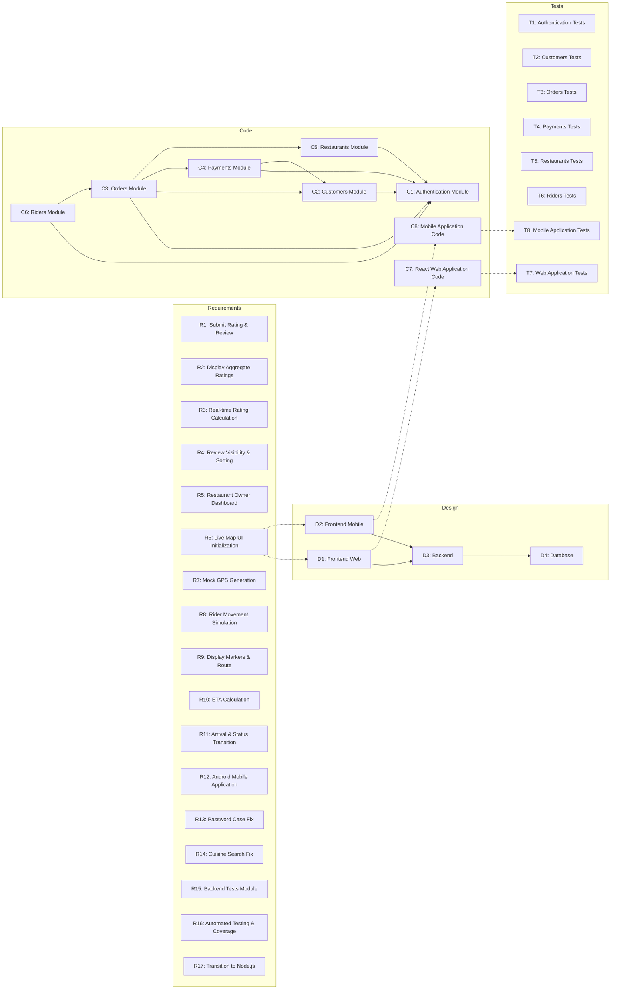
```mermaid
graph LR

%% =====================
%% Requirements
%% =====================
subgraph Requirements
R1[R1: Submit Rating & Review]
R2[R2: Display Aggregate Ratings]
R3[R3: Real-time Rating Calculation]
R4[R4: Review Visibility & Sorting]
R5[R5: Restaurant Owner Dashboard]
R6[R6: Live Map UI Initialization]
R7[R7: Mock GPS Generation]
R8[R8: Rider Movement Simulation]
R9[R9: Display Markers & Route]
R10[R10: ETA Calculation]
R11[R11: Arrival & Status Transition]
R12[R12: Android Mobile Application]
R13[R13: Password Case Fix]
R14[R14: Cuisine Search Fix]
R15[R15: Backend Tests Module]
R16[R16: Automated Testing & Coverage]
R17[R17: Transition to Node.js]
end

%% =====================
%% Design
%% =====================
subgraph Design
D1[D1: Frontend Web]
D2[D2: Frontend Mobile]
D3[D3: Backend]
D4[D4: Database]
end

%% =====================
%% Code Modules
%% =====================
subgraph Code
C1[C1: Authentication Module]
C2[C2: Customers Module]
C3[C3: Orders Module]
C4[C4: Payments Module]
C5[C5: Restaurants Module]
C6[C6: Riders Module]
C7[C7: React Web Application Code]
C8[C8: Mobile Application Code]
end

%% =====================
%% Tests
%% =====================
subgraph Tests
T1[T1: Authentication Tests]
T2[T2: Customers Tests]
T3[T3: Orders Tests]
T4[T4: Payments Tests]
T5[T5: Restaurants Tests]
T6[T6: Riders Tests]
T7[T7: Web Application Tests]
T8[T8: Mobile Application Tests]
end

%% Requirement → Design
%% R1 -.-> D1
%% R1 -.-> D2
%% R1 -.-> D3
%% R1 -.-> D4
%% R2 -.-> D1
%% R2 -.-> D2
%% R3 -.-> D3
%% R3 -.-> D4
%% R4 -.-> D1
%% R4 -.-> D2
%% R4 -.-> D3
%% R4 -.-> D4
%% R5 -.-> D1
%% R5 -.-> D2
%% R5 -.-> D3
%% R5 -.-> D4
R6 -.-> D1
R6 -.-> D2
%% R7 -.-> D1
%% R7 -.-> D2
%% R8 -.-> D1
%% R8 -.-> D2
%% R9 -.-> D1
%% R9 -.-> D2
%% R10 -.-> D1
%% R10 -.-> D2
%% R11 -.-> D1
%% R11 -.-> D2
%% R12 -.-> D2
%% R13 -.-> D3
%% R13 -.-> D4
%% R14 -.-> D1
%% R14 -.-> D2
%% R15 -.-> D3
%% R16 -.-> D3
%% R17 -.-> D3 
%% R17 -.-> D1
%% R17 -.-> D2
%% R17 -.-> D4 

%% Design --> Design
D1 --> D3
D2 --> D3
D3 --> D4
%% Design → Code
%% D3 -.-> C1
%% D3 -.-> C2
%% D3 -.-> C3
%% D3 -.-> C4
%% D3 -.-> C5
%% D3 -.-> C6

D1 -.-> C7
D2 -.-> C8


%% D4 -.-> C1
%% D4 -.-> C2
%% D4 -.-> C3
%% D4 -.-> C4
%% D4 -.-> C5
%% D4 -.-> C6


%% Code --> Code
C2 --> C1
C3 --> C1
C4 --> C1
C5 --> C1
C6 --> C1

C3 --> C2
C4 --> C2

C6 --> C3

C3 --> C4

C3 --> C5


%% Code → Tests
%% C1 -.-> T1
%% C2 -.-> T2
%% C3 -.-> T3
%% C4 -.-> T4
%% C5 -.-> T5
%% C6 -.-> T6
C7 -.-> T7
C8 -.-> T8
```

**R7: Mock GPS Generation**
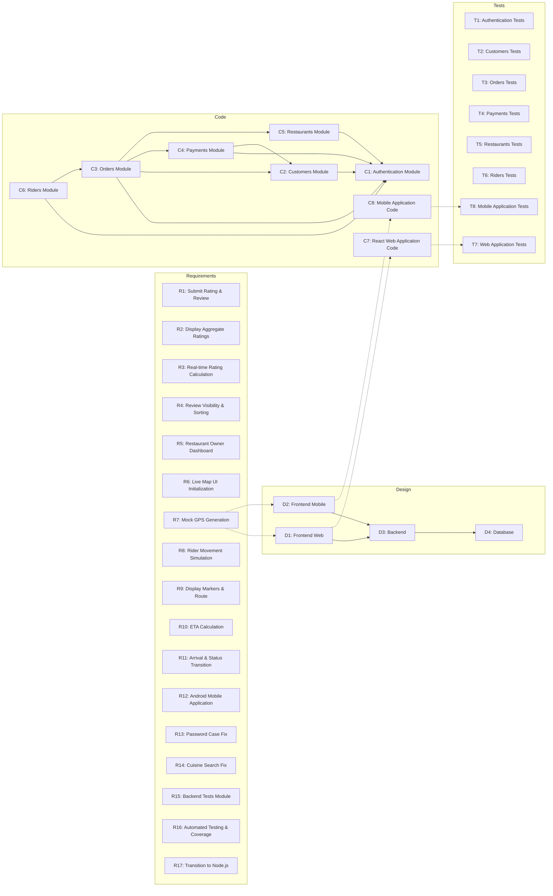
```mermaid
graph LR

%% =====================
%% Requirements
%% R7
%% =====================
subgraph Requirements
R1[R1: Submit Rating & Review]
R2[R2: Display Aggregate Ratings]
R3[R3: Real-time Rating Calculation]
R4[R4: Review Visibility & Sorting]
R5[R5: Restaurant Owner Dashboard]
R6[R6: Live Map UI Initialization]
R7[R7: Mock GPS Generation]
R8[R8: Rider Movement Simulation]
R9[R9: Display Markers & Route]
R10[R10: ETA Calculation]
R11[R11: Arrival & Status Transition]
R12[R12: Android Mobile Application]
R13[R13: Password Case Fix]
R14[R14: Cuisine Search Fix]
R15[R15: Backend Tests Module]
R16[R16: Automated Testing & Coverage]
R17[R17: Transition to Node.js]
end

%% =====================
%% Design
%% =====================
subgraph Design
D1[D1: Frontend Web]
D2[D2: Frontend Mobile]
D3[D3: Backend]
D4[D4: Database]
end

%% =====================
%% Code Modules
%% =====================
subgraph Code
C1[C1: Authentication Module]
C2[C2: Customers Module]
C3[C3: Orders Module]
C4[C4: Payments Module]
C5[C5: Restaurants Module]
C6[C6: Riders Module]
C7[C7: React Web Application Code]
C8[C8: Mobile Application Code]
end

%% =====================
%% Tests
%% =====================
subgraph Tests
T1[T1: Authentication Tests]
T2[T2: Customers Tests]
T3[T3: Orders Tests]
T4[T4: Payments Tests]
T5[T5: Restaurants Tests]
T6[T6: Riders Tests]
T7[T7: Web Application Tests]
T8[T8: Mobile Application Tests]
end

%% Requirement → Design
%% R1 -.-> D1
%% R1 -.-> D2
%% R1 -.-> D3
%% R1 -.-> D4
%% R2 -.-> D1
%% R2 -.-> D2
%% R3 -.-> D3
%% R3 -.-> D4
%% R4 -.-> D1
%% R4 -.-> D2
%% R4 -.-> D3
%% R4 -.-> D4
%% R5 -.-> D1
%% R5 -.-> D2
%% R5 -.-> D3
%% R5 -.-> D4
%% R6 -.-> D1
%% R6 -.-> D2
R7 -.-> D1
R7 -.-> D2
%% R8 -.-> D1
%% R8 -.-> D2
%% R9 -.-> D1
%% R9 -.-> D2
%% R10 -.-> D1
%% R10 -.-> D2
%% R11 -.-> D1
%% R11 -.-> D2
%% R12 -.-> D2
%% R13 -.-> D3
%% R13 -.-> D4
%% R14 -.-> D1
%% R14 -.-> D2
%% R15 -.-> D3
%% R16 -.-> D3
%% R17 -.-> D3 
%% R17 -.-> D1
%% R17 -.-> D2
%% R17 -.-> D4 

%% Design --> Design
D1 --> D3
D2 --> D3
D3 --> D4
%% Design → Code
%% D3 -.-> C1
%% D3 -.-> C2
%% D3 -.-> C3
%% D3 -.-> C4
%% D3 -.-> C5
%% D3 -.-> C6

D1 -.-> C7
D2 -.-> C8


%% D4 -.-> C1
%% D4 -.-> C2
%% D4 -.-> C3
%% D4 -.-> C4
%% D4 -.-> C5
%% D4 -.-> C6


%% Code --> Code
C2 --> C1
C3 --> C1
C4 --> C1
C5 --> C1
C6 --> C1

C3 --> C2
C4 --> C2

C6 --> C3

C3 --> C4

C3 --> C5


%% Code → Tests
%% C1 -.-> T1
%% C2 -.-> T2
%% C3 -.-> T3
%% C4 -.-> T4
%% C5 -.-> T5
%% C6 -.-> T6
C7 -.-> T7
C8 -.-> T8
```

**R8: Rider Movement Simulation**
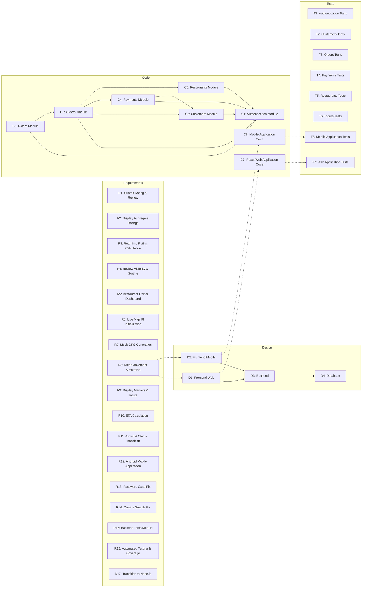
```mermaid
graph LR
subgraph Requirements
R1[R1: Submit Rating & Review]
R2[R2: Display Aggregate Ratings]
R3[R3: Real-time Rating Calculation]
R4[R4: Review Visibility & Sorting]
R5[R5: Restaurant Owner Dashboard]
R6[R6: Live Map UI Initialization]
R7[R7: Mock GPS Generation]
R8[R8: Rider Movement Simulation]
R9[R9: Display Markers & Route]
R10[R10: ETA Calculation]
R11[R11: Arrival & Status Transition]
R12[R12: Android Mobile Application]
R13[R13: Password Case Fix]
R14[R14: Cuisine Search Fix]
R15[R15: Backend Tests Module]
R16[R16: Automated Testing & Coverage]
R17[R17: Transition to Node.js]
end

%% =====================
%% Design
%% =====================
subgraph Design
D1[D1: Frontend Web]
D2[D2: Frontend Mobile]
D3[D3: Backend]
D4[D4: Database]
end

%% =====================
%% Code Modules
%% =====================
subgraph Code
C1[C1: Authentication Module]
C2[C2: Customers Module]
C3[C3: Orders Module]
C4[C4: Payments Module]
C5[C5: Restaurants Module]
C6[C6: Riders Module]
C7[C7: React Web Application Code]
C8[C8: Mobile Application Code]
end

%% =====================
%% Tests
%% =====================
subgraph Tests
T1[T1: Authentication Tests]
T2[T2: Customers Tests]
T3[T3: Orders Tests]
T4[T4: Payments Tests]
T5[T5: Restaurants Tests]
T6[T6: Riders Tests]
T7[T7: Web Application Tests]
T8[T8: Mobile Application Tests]
end

%% Requirement → Design
%% R1 -.-> D1
%% R1 -.-> D2
%% R1 -.-> D3
%% R1 -.-> D4
%% R2 -.-> D1
%% R2 -.-> D2
%% R3 -.-> D3
%% R3 -.-> D4
%% R4 -.-> D1
%% R4 -.-> D2
%% R4 -.-> D3
%% R4 -.-> D4
%% R5 -.-> D1
%% R5 -.-> D2
%% R5 -.-> D3
%% R5 -.-> D4
%% R6 -.-> D1
%% R6 -.-> D2
%% R7 -.-> D1
%% R7 -.-> D2
R8 -.-> D1
R8 -.-> D2
%% R9 -.-> D1
%% R9 -.-> D2
%% R10 -.-> D1
%% R10 -.-> D2
%% R11 -.-> D1
%% R11 -.-> D2
%% R12 -.-> D2
%% R13 -.-> D3
%% R13 -.-> D4
%% R14 -.-> D1
%% R14 -.-> D2
%% R15 -.-> D3
%% R16 -.-> D3
%% R17 -.-> D3 
%% R17 -.-> D1
%% R17 -.-> D2
%% R17 -.-> D4 

%% Design --> Design
D1 --> D3
D2 --> D3
D3 --> D4
%% Design → Code
%% D3 -.-> C1
%% D3 -.-> C2
%% D3 -.-> C3
%% D3 -.-> C4
%% D3 -.-> C5
%% D3 -.-> C6

D1 -.-> C7
D2 -.-> C8


%% D4 -.-> C1
%% D4 -.-> C2
%% D4 -.-> C3
%% D4 -.-> C4
%% D4 -.-> C5
%% D4 -.-> C6


%% Code --> Code
C2 --> C1
C3 --> C1
C4 --> C1
C5 --> C1
C6 --> C1

C3 --> C2
C4 --> C2

C6 --> C3

C3 --> C4

C3 --> C5


%% Code → Tests
%% C1 -.-> T1
%% C2 -.-> T2
%% C3 -.-> T3
%% C4 -.-> T4
%% C5 -.-> T5
%% C6 -.-> T6
C7 -.-> T7
C8 -.-> T8
```

**R9: Display Markers & Route**
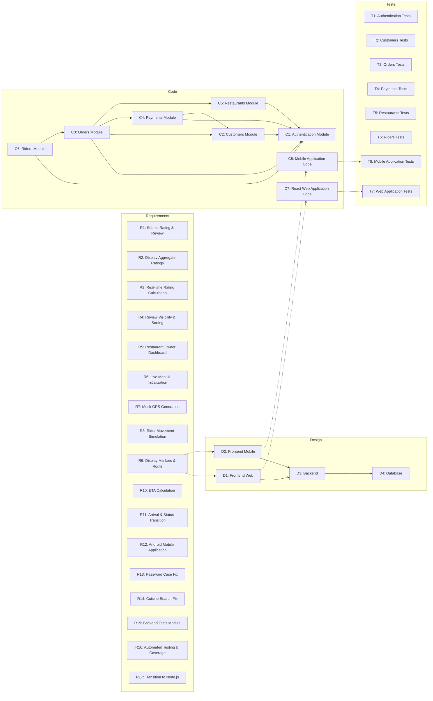
```mermaid
graph LR

subgraph Requirements
R1[R1: Submit Rating & Review]
R2[R2: Display Aggregate Ratings]
R3[R3: Real-time Rating Calculation]
R4[R4: Review Visibility & Sorting]
R5[R5: Restaurant Owner Dashboard]
R6[R6: Live Map UI Initialization]
R7[R7: Mock GPS Generation]
R8[R8: Rider Movement Simulation]
R9[R9: Display Markers & Route]
R10[R10: ETA Calculation]
R11[R11: Arrival & Status Transition]
R12[R12: Android Mobile Application]
R13[R13: Password Case Fix]
R14[R14: Cuisine Search Fix]
R15[R15: Backend Tests Module]
R16[R16: Automated Testing & Coverage]
R17[R17: Transition to Node.js]
end

%% =====================
%% Design
%% =====================
subgraph Design
D1[D1: Frontend Web]
D2[D2: Frontend Mobile]
D3[D3: Backend]
D4[D4: Database]
end

%% =====================
%% Code Modules
%% =====================
subgraph Code
C1[C1: Authentication Module]
C2[C2: Customers Module]
C3[C3: Orders Module]
C4[C4: Payments Module]
C5[C5: Restaurants Module]
C6[C6: Riders Module]
C7[C7: React Web Application Code]
C8[C8: Mobile Application Code]
end

%% =====================
%% Tests
%% =====================
subgraph Tests
T1[T1: Authentication Tests]
T2[T2: Customers Tests]
T3[T3: Orders Tests]
T4[T4: Payments Tests]
T5[T5: Restaurants Tests]
T6[T6: Riders Tests]
T7[T7: Web Application Tests]
T8[T8: Mobile Application Tests]
end

%% Requirement → Design
%% R1 -.-> D1
%% R1 -.-> D2
%% R1 -.-> D3
%% R1 -.-> D4
%% R2 -.-> D1
%% R2 -.-> D2
%% R3 -.-> D3
%% R3 -.-> D4
%% R4 -.-> D1
%% R4 -.-> D2
%% R4 -.-> D3
%% R4 -.-> D4
%% R5 -.-> D1
%% R5 -.-> D2
%% R5 -.-> D3
%% R5 -.-> D4
%% R6 -.-> D1
%% R6 -.-> D2
%% R7 -.-> D1
%% R7 -.-> D2
%% R8 -.-> D1
%% R8 -.-> D2
R9 -.-> D1
R9 -.-> D2
%% R10 -.-> D1
%% R10 -.-> D2
%% R11 -.-> D1
%% R11 -.-> D2
%% R12 -.-> D2
%% R13 -.-> D3
%% R13 -.-> D4
%% R14 -.-> D1
%% R14 -.-> D2
%% R15 -.-> D3
%% R16 -.-> D3
%% R17 -.-> D3 
%% R17 -.-> D1
%% R17 -.-> D2
%% R17 -.-> D4 

%% Design --> Design
D1 --> D3
D2 --> D3
D3 --> D4
%% Design → Code
%% D3 -.-> C1
%% D3 -.-> C2
%% D3 -.-> C3
%% D3 -.-> C4
%% D3 -.-> C5
%% D3 -.-> C6

D1 -.-> C7
D2 -.-> C8


%% D4 -.-> C1
%% D4 -.-> C2
%% D4 -.-> C3
%% D4 -.-> C4
%% D4 -.-> C5
%% D4 -.-> C6


%% Code --> Code
C2 --> C1
C3 --> C1
C4 --> C1
C5 --> C1
C6 --> C1

C3 --> C2
C4 --> C2

C6 --> C3

C3 --> C4

C3 --> C5


%% Code → Tests
%% C1 -.-> T1
%% C2 -.-> T2
%% C3 -.-> T3
%% C4 -.-> T4
%% C5 -.-> T5
%% C6 -.-> T6
C7 -.-> T7
C8 -.-> T8
```

**R10: ETA Calculation**
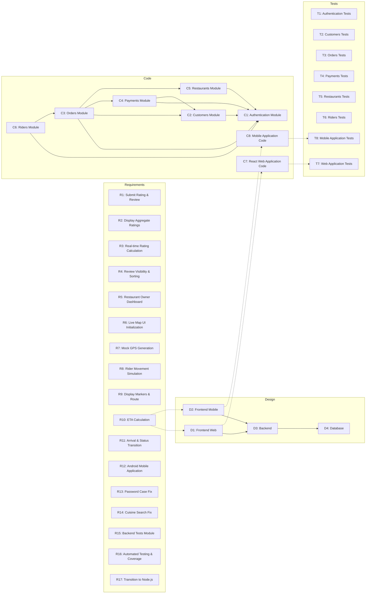
```mermaid
graph LR

subgraph Requirements
R1[R1: Submit Rating & Review]
R2[R2: Display Aggregate Ratings]
R3[R3: Real-time Rating Calculation]
R4[R4: Review Visibility & Sorting]
R5[R5: Restaurant Owner Dashboard]
R6[R6: Live Map UI Initialization]
R7[R7: Mock GPS Generation]
R8[R8: Rider Movement Simulation]
R9[R9: Display Markers & Route]
R10[R10: ETA Calculation]
R11[R11: Arrival & Status Transition]
R12[R12: Android Mobile Application]
R13[R13: Password Case Fix]
R14[R14: Cuisine Search Fix]
R15[R15: Backend Tests Module]
R16[R16: Automated Testing & Coverage]
R17[R17: Transition to Node.js]
end

%% =====================
%% Design
%% =====================
subgraph Design
D1[D1: Frontend Web]
D2[D2: Frontend Mobile]
D3[D3: Backend]
D4[D4: Database]
end

%% =====================
%% Code Modules
%% =====================
subgraph Code
C1[C1: Authentication Module]
C2[C2: Customers Module]
C3[C3: Orders Module]
C4[C4: Payments Module]
C5[C5: Restaurants Module]
C6[C6: Riders Module]
C7[C7: React Web Application Code]
C8[C8: Mobile Application Code]
end

%% =====================
%% Tests
%% =====================
subgraph Tests
T1[T1: Authentication Tests]
T2[T2: Customers Tests]
T3[T3: Orders Tests]
T4[T4: Payments Tests]
T5[T5: Restaurants Tests]
T6[T6: Riders Tests]
T7[T7: Web Application Tests]
T8[T8: Mobile Application Tests]
end

%% Requirement → Design
%% R1 -.-> D1
%% R1 -.-> D2
%% R1 -.-> D3
%% R1 -.-> D4
%% R2 -.-> D1
%% R2 -.-> D2
%% R3 -.-> D3
%% R3 -.-> D4
%% R4 -.-> D1
%% R4 -.-> D2
%% R4 -.-> D3
%% R4 -.-> D4
%% R5 -.-> D1
%% R5 -.-> D2
%% R5 -.-> D3
%% R5 -.-> D4
%% R6 -.-> D1
%% R6 -.-> D2
%% R7 -.-> D1
%% R7 -.-> D2
%% R8 -.-> D1
%% R8 -.-> D2
%% R9 -.-> D1
%% R9 -.-> D2
R10 -.-> D1
R10 -.-> D2
%% R11 -.-> D1
%% R11 -.-> D2
%% R12 -.-> D2
%% R13 -.-> D3
%% R13 -.-> D4
%% R14 -.-> D1
%% R14 -.-> D2
%% R15 -.-> D3
%% R16 -.-> D3
%% R17 -.-> D3 
%% R17 -.-> D1
%% R17 -.-> D2
%% R17 -.-> D4 

%% Design --> Design
D1 --> D3
D2 --> D3
D3 --> D4
%% Design → Code
%% D3 -.-> C1
%% D3 -.-> C2
%% D3 -.-> C3
%% D3 -.-> C4
%% D3 -.-> C5
%% D3 -.-> C6

D1 -.-> C7
D2 -.-> C8


%% D4 -.-> C1
%% D4 -.-> C2
%% D4 -.-> C3
%% D4 -.-> C4
%% D4 -.-> C5
%% D4 -.-> C6


%% Code --> Code
C2 --> C1
C3 --> C1
C4 --> C1
C5 --> C1
C6 --> C1

C3 --> C2
C4 --> C2

C6 --> C3

C3 --> C4

C3 --> C5


%% Code → Tests
%% C1 -.-> T1
%% C2 -.-> T2
%% C3 -.-> T3
%% C4 -.-> T4
%% C5 -.-> T5
%% C6 -.-> T6
C7 -.-> T7
C8 -.-> T8
```

**R11: Arrival & Status Transition**
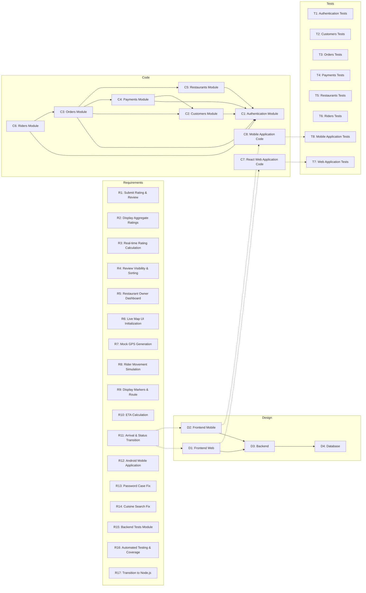
```mermaid
graph LR

subgraph Requirements
R1[R1: Submit Rating & Review]
R2[R2: Display Aggregate Ratings]
R3[R3: Real-time Rating Calculation]
R4[R4: Review Visibility & Sorting]
R5[R5: Restaurant Owner Dashboard]
R6[R6: Live Map UI Initialization]
R7[R7: Mock GPS Generation]
R8[R8: Rider Movement Simulation]
R9[R9: Display Markers & Route]
R10[R10: ETA Calculation]
R11[R11: Arrival & Status Transition]
R12[R12: Android Mobile Application]
R13[R13: Password Case Fix]
R14[R14: Cuisine Search Fix]
R15[R15: Backend Tests Module]
R16[R16: Automated Testing & Coverage]
R17[R17: Transition to Node.js]
end

%% =====================
%% Design
%% =====================
subgraph Design
D1[D1: Frontend Web]
D2[D2: Frontend Mobile]
D3[D3: Backend]
D4[D4: Database]
end

%% =====================
%% Code Modules
%% =====================
subgraph Code
C1[C1: Authentication Module]
C2[C2: Customers Module]
C3[C3: Orders Module]
C4[C4: Payments Module]
C5[C5: Restaurants Module]
C6[C6: Riders Module]
C7[C7: React Web Application Code]
C8[C8: Mobile Application Code]
end

%% =====================
%% Tests
%% =====================
subgraph Tests
T1[T1: Authentication Tests]
T2[T2: Customers Tests]
T3[T3: Orders Tests]
T4[T4: Payments Tests]
T5[T5: Restaurants Tests]
T6[T6: Riders Tests]
T7[T7: Web Application Tests]
T8[T8: Mobile Application Tests]
end

%% Requirement → Design
%% R1 -.-> D1
%% R1 -.-> D2
%% R1 -.-> D3
%% R1 -.-> D4
%% R2 -.-> D1
%% R2 -.-> D2
%% R3 -.-> D3
%% R3 -.-> D4
%% R4 -.-> D1
%% R4 -.-> D2
%% R4 -.-> D3
%% R4 -.-> D4
%% R5 -.-> D1
%% R5 -.-> D2
%% R5 -.-> D3
%% R5 -.-> D4
%% R6 -.-> D1
%% R6 -.-> D2
%% R7 -.-> D1
%% R7 -.-> D2
%% R8 -.-> D1
%% R8 -.-> D2
%% R9 -.-> D1
%% R9 -.-> D2
%% R10 -.-> D1
%% R10 -.-> D2
R11 -.-> D1
R11 -.-> D2
%% R12 -.-> D2
%% R13 -.-> D3
%% R13 -.-> D4
%% R14 -.-> D1
%% R14 -.-> D2
%% R15 -.-> D3
%% R16 -.-> D3
%% R17 -.-> D3 
%% R17 -.-> D1
%% R17 -.-> D2
%% R17 -.-> D4 

%% Design --> Design
D1 --> D3
D2 --> D3
D3 --> D4
%% Design → Code
%% D3 -.-> C1
%% D3 -.-> C2
%% D3 -.-> C3
%% D3 -.-> C4
%% D3 -.-> C5
%% D3 -.-> C6

D1 -.-> C7
D2 -.-> C8


%% D4 -.-> C1
%% D4 -.-> C2
%% D4 -.-> C3
%% D4 -.-> C4
%% D4 -.-> C5
%% D4 -.-> C6


%% Code --> Code
C2 --> C1
C3 --> C1
C4 --> C1
C5 --> C1
C6 --> C1

C3 --> C2
C4 --> C2

C6 --> C3

C3 --> C4

C3 --> C5


%% Code → Tests
%% C1 -.-> T1
%% C2 -.-> T2
%% C3 -.-> T3
%% C4 -.-> T4
%% C5 -.-> T5
%% C6 -.-> T6
C7 -.-> T7
C8 -.-> T8
```

**R12: Android Mobile Application**
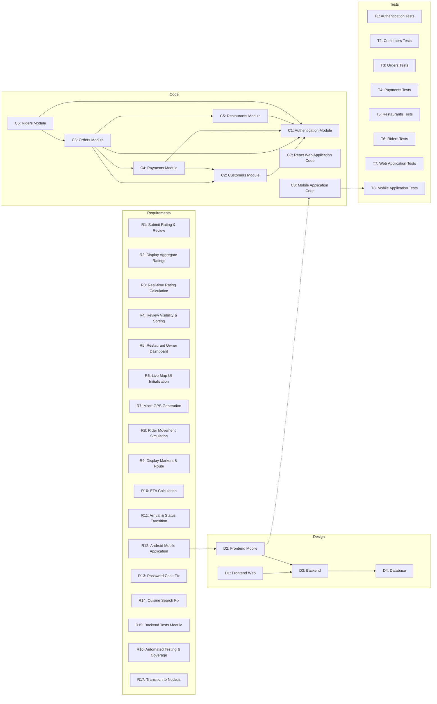
```mermaid
graph LR

subgraph Requirements
R1[R1: Submit Rating & Review]
R2[R2: Display Aggregate Ratings]
R3[R3: Real-time Rating Calculation]
R4[R4: Review Visibility & Sorting]
R5[R5: Restaurant Owner Dashboard]
R6[R6: Live Map UI Initialization]
R7[R7: Mock GPS Generation]
R8[R8: Rider Movement Simulation]
R9[R9: Display Markers & Route]
R10[R10: ETA Calculation]
R11[R11: Arrival & Status Transition]
R12[R12: Android Mobile Application]
R13[R13: Password Case Fix]
R14[R14: Cuisine Search Fix]
R15[R15: Backend Tests Module]
R16[R16: Automated Testing & Coverage]
R17[R17: Transition to Node.js]
end

%% =====================
%% Design
%% =====================
subgraph Design
D1[D1: Frontend Web]
D2[D2: Frontend Mobile]
D3[D3: Backend]
D4[D4: Database]
end

%% =====================
%% Code Modules
%% =====================
subgraph Code
C1[C1: Authentication Module]
C2[C2: Customers Module]
C3[C3: Orders Module]
C4[C4: Payments Module]
C5[C5: Restaurants Module]
C6[C6: Riders Module]
C7[C7: React Web Application Code]
C8[C8: Mobile Application Code]
end

%% =====================
%% Tests
%% =====================
subgraph Tests
T1[T1: Authentication Tests]
T2[T2: Customers Tests]
T3[T3: Orders Tests]
T4[T4: Payments Tests]
T5[T5: Restaurants Tests]
T6[T6: Riders Tests]
T7[T7: Web Application Tests]
T8[T8: Mobile Application Tests]
end

%% Requirement → Design
%% R1 -.-> D1
%% R1 -.-> D2
%% R1 -.-> D3
%% R1 -.-> D4
%% R2 -.-> D1
%% R2 -.-> D2
%% R3 -.-> D3
%% R3 -.-> D4
%% R4 -.-> D1
%% R4 -.-> D2
%% R4 -.-> D3
%% R4 -.-> D4
%% R5 -.-> D1
%% R5 -.-> D2
%% R5 -.-> D3
%% R5 -.-> D4
%% R6 -.-> D1
%% R6 -.-> D2
%% R7 -.-> D1
%% R7 -.-> D2
%% R8 -.-> D1
%% R8 -.-> D2
%% R9 -.-> D1
%% R9 -.-> D2
%% R10 -.-> D1
%% R10 -.-> D2
%% R11 -.-> D1
%% R11 -.-> D2
R12 -.-> D2
%% R13 -.-> D3
%% R13 -.-> D4
%% R14 -.-> D1
%% R14 -.-> D2
%% R15 -.-> D3
%% R16 -.-> D3
%% R17 -.-> D3 
%% R17 -.-> D1
%% R17 -.-> D2
%% R17 -.-> D4 

%% Design --> Design
D1 --> D3
D2 --> D3
D3 --> D4
%% Design → Code
%% D3 -.-> C1
%% D3 -.-> C2
%% D3 -.-> C3
%% D3 -.-> C4
%% D3 -.-> C5
%% D3 -.-> C6

%% D1 -.-> C7
D2 -.-> C8


%% D4 -.-> C1
%% D4 -.-> C2
%% D4 -.-> C3
%% D4 -.-> C4
%% D4 -.-> C5
%% D4 -.-> C6


%% Code --> Code
C2 --> C1
C3 --> C1
C4 --> C1
C5 --> C1
C6 --> C1

C3 --> C2
C4 --> C2

C6 --> C3

C3 --> C4

C3 --> C5


%% Code → Tests
%% C1 -.-> T1
%% C2 -.-> T2
%% C3 -.-> T3
%% C4 -.-> T4
%% C5 -.-> T5
%% C6 -.-> T6
%% C7 -.-> T7
C8 -.-> T8
```

**R13: Password Case Fix**
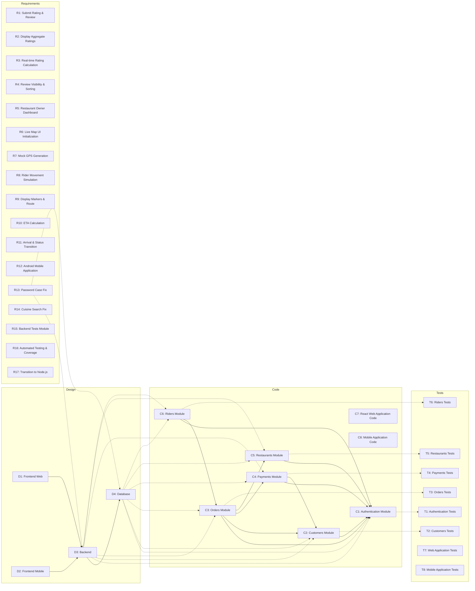
```mermaid
graph LR

%% =====================
%% Requirements
%% =====================
subgraph Requirements
R1[R1: Submit Rating & Review]
R2[R2: Display Aggregate Ratings]
R3[R3: Real-time Rating Calculation]
R4[R4: Review Visibility & Sorting]
R5[R5: Restaurant Owner Dashboard]
R6[R6: Live Map UI Initialization]
R7[R7: Mock GPS Generation]
R8[R8: Rider Movement Simulation]
R9[R9: Display Markers & Route]
R10[R10: ETA Calculation]
R11[R11: Arrival & Status Transition]
R12[R12: Android Mobile Application]
R13[R13: Password Case Fix]
R14[R14: Cuisine Search Fix]
R15[R15: Backend Tests Module]
R16[R16: Automated Testing & Coverage]
R17[R17: Transition to Node.js]
end

%% =====================
%% Design
%% =====================
subgraph Design
D1[D1: Frontend Web]
D2[D2: Frontend Mobile]
D3[D3: Backend]
D4[D4: Database]
end

%% =====================
%% Code Modules
%% =====================
subgraph Code
C1[C1: Authentication Module]
C2[C2: Customers Module]
C3[C3: Orders Module]
C4[C4: Payments Module]
C5[C5: Restaurants Module]
C6[C6: Riders Module]
C7[C7: React Web Application Code]
C8[C8: Mobile Application Code]
end

%% =====================
%% Tests
%% =====================
subgraph Tests
T1[T1: Authentication Tests]
T2[T2: Customers Tests]
T3[T3: Orders Tests]
T4[T4: Payments Tests]
T5[T5: Restaurants Tests]
T6[T6: Riders Tests]
T7[T7: Web Application Tests]
T8[T8: Mobile Application Tests]
end

%% Requirement → Design
%% R1 -.-> D1
%% R1 -.-> D2
%% R1 -.-> D3
%% R1 -.-> D4
%% R2 -.-> D1
%% R2 -.-> D2
%% R3 -.-> D3
%% R3 -.-> D4
%% R4 -.-> D1
%% R4 -.-> D2
%% R4 -.-> D3
%% R4 -.-> D4
%% R5 -.-> D1
%% R5 -.-> D2
%% R5 -.-> D3
%% R5 -.-> D4
%% R6 -.-> D1
%% R6 -.-> D2
%% R7 -.-> D1
%% R7 -.-> D2
%% R8 -.-> D1
%% R8 -.-> D2
%% R9 -.-> D1
%% R9 -.-> D2
%% R10 -.-> D1
%% R10 -.-> D2
%% R11 -.-> D1
%% R11 -.-> D2
%% R12 -.-> D2
R13 -.-> D3
R13 -.-> D4
%% R14 -.-> D1
%% R14 -.-> D2
%% R15 -.-> D3
%% R16 -.-> D3
%% R17 -.-> D3 
%% R17 -.-> D1
%% R17 -.-> D2
%% R17 -.-> D4 

%% Design --> Design
D1 --> D3
D2 --> D3
D3 --> D4
%% Design → Code
D3 -.-> C1
D3 -.-> C2
D3 -.-> C3
D3 -.-> C4
D3 -.-> C5
D3 -.-> C6

%% D1 -.-> C7
%% D2 -.-> C8


D4 -.-> C1
D4 -.-> C2
D4 -.-> C3
D4 -.-> C4
D4 -.-> C5
D4 -.-> C6


%% Code --> Code
C2 --> C1
C3 --> C1
C4 --> C1
C5 --> C1
C6 --> C1

C3 --> C2
C4 --> C2

C6 --> C3

C3 --> C4

C3 --> C5


%% Code → Tests
C1 -.-> T1
C2 -.-> T2
C3 -.-> T3
C4 -.-> T4
C5 -.-> T5
C6 -.-> T6
%% C7 -.-> T7
%% C8 -.-> T8
```

**R14: Cuisine Search Fix**
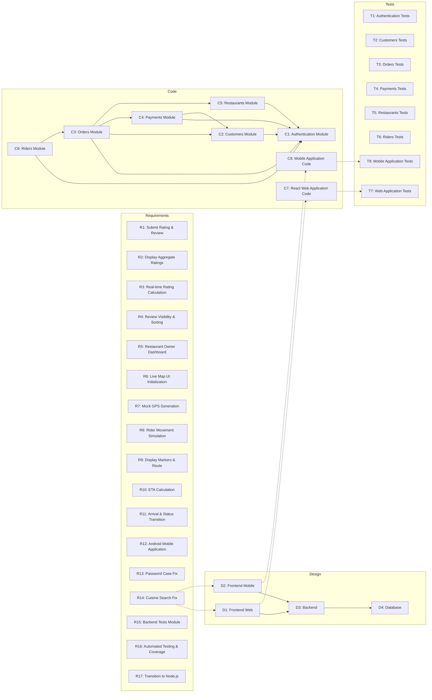
```mermaid
graph LR

%% =====================
%% Requirements
%% =====================
subgraph Requirements
R1[R1: Submit Rating & Review]
R2[R2: Display Aggregate Ratings]
R3[R3: Real-time Rating Calculation]
R4[R4: Review Visibility & Sorting]
R5[R5: Restaurant Owner Dashboard]
R6[R6: Live Map UI Initialization]
R7[R7: Mock GPS Generation]
R8[R8: Rider Movement Simulation]
R9[R9: Display Markers & Route]
R10[R10: ETA Calculation]
R11[R11: Arrival & Status Transition]
R12[R12: Android Mobile Application]
R13[R13: Password Case Fix]
R14[R14: Cuisine Search Fix]
R15[R15: Backend Tests Module]
R16[R16: Automated Testing & Coverage]
R17[R17: Transition to Node.js]
end

%% =====================
%% Design
%% =====================
subgraph Design
D1[D1: Frontend Web]
D2[D2: Frontend Mobile]
D3[D3: Backend]
D4[D4: Database]
end

%% =====================
%% Code Modules
%% =====================
subgraph Code
C1[C1: Authentication Module]
C2[C2: Customers Module]
C3[C3: Orders Module]
C4[C4: Payments Module]
C5[C5: Restaurants Module]
C6[C6: Riders Module]
C7[C7: React Web Application Code]
C8[C8: Mobile Application Code]
end

%% =====================
%% Tests
%% =====================
subgraph Tests
T1[T1: Authentication Tests]
T2[T2: Customers Tests]
T3[T3: Orders Tests]
T4[T4: Payments Tests]
T5[T5: Restaurants Tests]
T6[T6: Riders Tests]
T7[T7: Web Application Tests]
T8[T8: Mobile Application Tests]
end

%% Requirement → Design
%% R1 -.-> D1
%% R1 -.-> D2
%% R1 -.-> D3
%% R1 -.-> D4
%% R2 -.-> D1
%% R2 -.-> D2
%% R3 -.-> D3
%% R3 -.-> D4
%% R4 -.-> D1
%% R4 -.-> D2
%% R4 -.-> D3
%% R4 -.-> D4
%% R5 -.-> D1
%% R5 -.-> D2
%% R5 -.-> D3
%% R5 -.-> D4
%% R6 -.-> D1
%% R6 -.-> D2
%% R7 -.-> D1
%% R7 -.-> D2
%% R8 -.-> D1
%% R8 -.-> D2
%% R9 -.-> D1
%% R9 -.-> D2
%% R10 -.-> D1
%% R10 -.-> D2
%% R11 -.-> D1
%% R11 -.-> D2
%% R12 -.-> D2
%% R13 -.-> D3
%% R13 -.-> D4
R14 -.-> D1
R14 -.-> D2
%% R15 -.-> D3
%% R16 -.-> D3
%% R17 -.-> D3 
%% R17 -.-> D1
%% R17 -.-> D2
%% R17 -.-> D4 

%% Design --> Design
D1 --> D3
D2 --> D3
D3 --> D4
%% Design → Code
%% D3 -.-> C1
%% D3 -.-> C2
%% D3 -.-> C3
%% D3 -.-> C4
%% D3 -.-> C5
%% D3 -.-> C6

D1 -.-> C7
D2 -.-> C8


%% D4 -.-> C1
%% D4 -.-> C2
%% D4 -.-> C3
%% D4 -.-> C4
%% D4 -.-> C5
%% D4 -.-> C6


%% Code --> Code
C2 --> C1
C3 --> C1
C4 --> C1
C5 --> C1
C6 --> C1

C3 --> C2
C4 --> C2

C6 --> C3

C3 --> C4

C3 --> C5


%% Code → Tests
%% C1 -.-> T1
%% C2 -.-> T2
%% C3 -.-> T3
%% C4 -.-> T4
%% C5 -.-> T5
%% C6 -.-> T6
C7 -.-> T7
C8 -.-> T8
```

**R15: Backend Tests Module**

```mermaid
graph LR

%% =====================
%% Requirements
%% =====================
subgraph Requirements
R1[R1: Submit Rating & Review]
R2[R2: Display Aggregate Ratings]
R3[R3: Real-time Rating Calculation]
R4[R4: Review Visibility & Sorting]
R5[R5: Restaurant Owner Dashboard]
R6[R6: Live Map UI Initialization]
R7[R7: Mock GPS Generation]
R8[R8: Rider Movement Simulation]
R9[R9: Display Markers & Route]
R10[R10: ETA Calculation]
R11[R11: Arrival & Status Transition]
R12[R12: Android Mobile Application]
R13[R13: Password Case Fix]
R14[R14: Cuisine Search Fix]
R15[R15: Backend Tests Module]
R16[R16: Automated Testing & Coverage]
R17[R17: Transition to Node.js]
end

%% =====================
%% Design
%% =====================
subgraph Design
D1[D1: Frontend Web]
D2[D2: Frontend Mobile]
D3[D3: Backend]
D4[D4: Database]
end

%% =====================
%% Code Modules
%% =====================
subgraph Code
C1[C1: Authentication Module]
C2[C2: Customers Module]
C3[C3: Orders Module]
C4[C4: Payments Module]
C5[C5: Restaurants Module]
C6[C6: Riders Module]
C7[C7: React Web Application Code]
C8[C8: Mobile Application Code]
end

%% =====================
%% Tests
%% =====================
subgraph Tests
T1[T1: Authentication Tests]
T2[T2: Customers Tests]
T3[T3: Orders Tests]
T4[T4: Payments Tests]
T5[T5: Restaurants Tests]
T6[T6: Riders Tests]
T7[T7: Web Application Tests]
T8[T8: Mobile Application Tests]
end

%% Requirement → Design
%% R1 -.-> D1
%% R1 -.-> D2
%% R1 -.-> D3
%% R1 -.-> D4
%% R2 -.-> D1
%% R2 -.-> D2
%% R3 -.-> D3
%% R3 -.-> D4
%% R4 -.-> D1
%% R4 -.-> D2
%% R4 -.-> D3
%% R4 -.-> D4
%% R5 -.-> D1
%% R5 -.-> D2
%% R5 -.-> D3
%% R5 -.-> D4
%% R6 -.-> D1
%% R6 -.-> D2
%% R7 -.-> D1
%% R7 -.-> D2
%% R8 -.-> D1
%% R8 -.-> D2
%% R9 -.-> D1
%% R9 -.-> D2
%% R10 -.-> D1
%% R10 -.-> D2
%% R11 -.-> D1
%% R11 -.-> D2
%% R12 -.-> D2
%% R13 -.-> D3
%% R13 -.-> D4
%% R14 -.-> D1
%% R14 -.-> D2
R15 -.-> D3
%% R16 -.-> D3
%% R17 -.-> D3 
%% R17 -.-> D1
%% R17 -.-> D2
%% R17 -.-> D4 

%% Design --> Design
D1 --> D3
D2 --> D3
D3 --> D4
%% Design → Code
D3 -.-> C1
D3 -.-> C2
D3 -.-> C3
D3 -.-> C4
D3 -.-> C5
D3 -.-> C6

%% D1 -.-> C7
%% D2 -.-> C8


%% D4 -.-> C1
%% D4 -.-> C2
%% D4 -.-> C3
%% D4 -.-> C4
%% D4 -.-> C5
%% D4 -.-> C6


%% Code --> Code
C2 --> C1
C3 --> C1
C4 --> C1
C5 --> C1
C6 --> C1

C3 --> C2
C4 --> C2

C6 --> C3

C3 --> C4

C3 --> C5


%% Code → Tests
C1 -.-> T1
C2 -.-> T2
C3 -.-> T3
C4 -.-> T4
C5 -.-> T5
C6 -.-> T6
%% C7 -.-> T7
%% C8 -.-> T8
```

**R16: Automated Testing & Coverage**
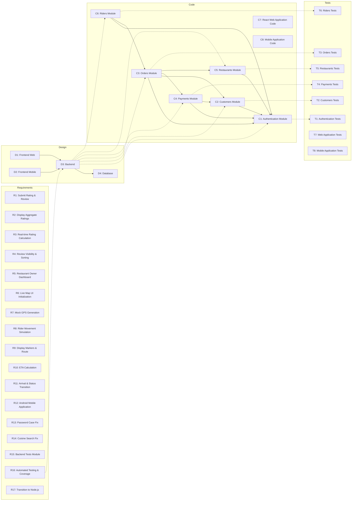
```mermaid
graph LR

%% =====================
%% Requirements
%% =====================
subgraph Requirements
R1[R1: Submit Rating & Review]
R2[R2: Display Aggregate Ratings]
R3[R3: Real-time Rating Calculation]
R4[R4: Review Visibility & Sorting]
R5[R5: Restaurant Owner Dashboard]
R6[R6: Live Map UI Initialization]
R7[R7: Mock GPS Generation]
R8[R8: Rider Movement Simulation]
R9[R9: Display Markers & Route]
R10[R10: ETA Calculation]
R11[R11: Arrival & Status Transition]
R12[R12: Android Mobile Application]
R13[R13: Password Case Fix]
R14[R14: Cuisine Search Fix]
R15[R15: Backend Tests Module]
R16[R16: Automated Testing & Coverage]
R17[R17: Transition to Node.js]
end

%% =====================
%% Design
%% =====================
subgraph Design
D1[D1: Frontend Web]
D2[D2: Frontend Mobile]
D3[D3: Backend]
D4[D4: Database]
end

%% =====================
%% Code Modules
%% =====================
subgraph Code
C1[C1: Authentication Module]
C2[C2: Customers Module]
C3[C3: Orders Module]
C4[C4: Payments Module]
C5[C5: Restaurants Module]
C6[C6: Riders Module]
C7[C7: React Web Application Code]
C8[C8: Mobile Application Code]
end

%% =====================
%% Tests
%% =====================
subgraph Tests
T1[T1: Authentication Tests]
T2[T2: Customers Tests]
T3[T3: Orders Tests]
T4[T4: Payments Tests]
T5[T5: Restaurants Tests]
T6[T6: Riders Tests]
T7[T7: Web Application Tests]
T8[T8: Mobile Application Tests]
end

%% Requirement → Design
%% R1 -.-> D1
%% R1 -.-> D2
%% R1 -.-> D3
%% R1 -.-> D4
%% R2 -.-> D1
%% R2 -.-> D2
%% R3 -.-> D3
%% R3 -.-> D4
%% R4 -.-> D1
%% R4 -.-> D2
%% R4 -.-> D3
%% R4 -.-> D4
%% R5 -.-> D1
%% R5 -.-> D2
%% R5 -.-> D3
%% R5 -.-> D4
%% R6 -.-> D1
%% R6 -.-> D2
%% R7 -.-> D1
%% R7 -.-> D2
%% R8 -.-> D1
%% R8 -.-> D2
%% R9 -.-> D1
%% R9 -.-> D2
%% R10 -.-> D1
%% R10 -.-> D2
%% R11 -.-> D1
%% R11 -.-> D2
%% R12 -.-> D2
%% R13 -.-> D3
%% R13 -.-> D4
%% R14 -.-> D1
%% R14 -.-> D2
%% R15 -.-> D3
R16 -.-> D3
%% R17 -.-> D3 
%% R17 -.-> D1
%% R17 -.-> D2
%% R17 -.-> D4 

%% Design --> Design
D1 --> D3
D2 --> D3
D3 --> D4
%% Design → Code
D3 -.-> C1
D3 -.-> C2
D3 -.-> C3
D3 -.-> C4
D3 -.-> C5
D3 -.-> C6

%% D1 -.-> C7
%% D2 -.-> C8


%% D4 -.-> C1
%% D4 -.-> C2
%% D4 -.-> C3
%% D4 -.-> C4
%% D4 -.-> C5
%% D4 -.-> C6


%% Code --> Code
C2 --> C1
C3 --> C1
C4 --> C1
C5 --> C1
C6 --> C1

C3 --> C2
C4 --> C2

C6 --> C3

C3 --> C4

C3 --> C5


%% Code → Tests
C1 -.-> T1
C2 -.-> T2
C3 -.-> T3
C4 -.-> T4
C5 -.-> T5
C6 -.-> T6
%% C7 -.-> T7
%% C8 -.-> T8
```

**R17: Transition to Node.js**
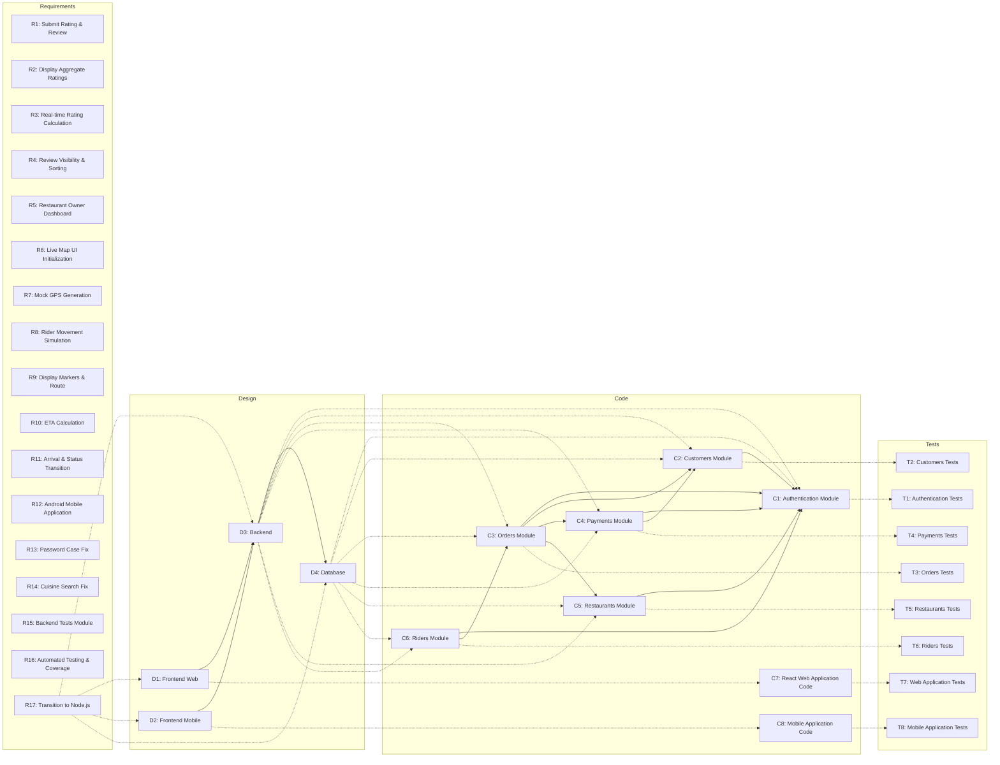
```mermaid
graph LR

%% =====================
%% Requirements
%% =====================
subgraph Requirements
R1[R1: Submit Rating & Review]
R2[R2: Display Aggregate Ratings]
R3[R3: Real-time Rating Calculation]
R4[R4: Review Visibility & Sorting]
R5[R5: Restaurant Owner Dashboard]
R6[R6: Live Map UI Initialization]
R7[R7: Mock GPS Generation]
R8[R8: Rider Movement Simulation]
R9[R9: Display Markers & Route]
R10[R10: ETA Calculation]
R11[R11: Arrival & Status Transition]
R12[R12: Android Mobile Application]
R13[R13: Password Case Fix]
R14[R14: Cuisine Search Fix]
R15[R15: Backend Tests Module]
R16[R16: Automated Testing & Coverage]
R17[R17: Transition to Node.js]
end

%% =====================
%% Design
%% =====================
subgraph Design
D1[D1: Frontend Web]
D2[D2: Frontend Mobile]
D3[D3: Backend]
D4[D4: Database]
end

%% =====================
%% Code Modules
%% =====================
subgraph Code
C1[C1: Authentication Module]
C2[C2: Customers Module]
C3[C3: Orders Module]
C4[C4: Payments Module]
C5[C5: Restaurants Module]
C6[C6: Riders Module]
C7[C7: React Web Application Code]
C8[C8: Mobile Application Code]
end

%% =====================
%% Tests
%% =====================
subgraph Tests
T1[T1: Authentication Tests]
T2[T2: Customers Tests]
T3[T3: Orders Tests]
T4[T4: Payments Tests]
T5[T5: Restaurants Tests]
T6[T6: Riders Tests]
T7[T7: Web Application Tests]
T8[T8: Mobile Application Tests]
end

%% Requirement → Design
%% R1 -.-> D1
%% R1 -.-> D2
%% R1 -.-> D3
%% R1 -.-> D4
%% R2 -.-> D1
%% R2 -.-> D2
%% R3 -.-> D3
%% R3 -.-> D4
%% R4 -.-> D1
%% R4 -.-> D2
%% R4 -.-> D3
%% R4 -.-> D4
%% R5 -.-> D1
%% R5 -.-> D2
%% R5 -.-> D3
%% R5 -.-> D4
%% R6 -.-> D1
%% R6 -.-> D2
%% R7 -.-> D1
%% R7 -.-> D2
%% R8 -.-> D1
%% R8 -.-> D2
%% R9 -.-> D1
%% R9 -.-> D2
%% R10 -.-> D1
%% R10 -.-> D2
%% R11 -.-> D1
%% R11 -.-> D2
%% R12 -.-> D2
%% R13 -.-> D3
%% R13 -.-> D4
%% R14 -.-> D1
%% R14 -.-> D2
%% R15 -.-> D3
%% R16 -.-> D3
R17 -.-> D3 
R17 -.-> D1
R17 -.-> D2
R17 -.-> D4 

%% Design --> Design
D1 --> D3
D2 --> D3
D3 --> D4
%% Design → Code
D3 -.-> C1
D3 -.-> C2
D3 -.-> C3
D3 -.-> C4
D3 -.-> C5
D3 -.-> C6

D1 -.-> C7
D2 -.-> C8


D4 -.-> C1
D4 -.-> C2
D4 -.-> C3
D4 -.-> C4
D4 -.-> C5
D4 -.-> C6


%% Code --> Code
C2 --> C1
C3 --> C1
C4 --> C1
C5 --> C1
C6 --> C1

C3 --> C2
C4 --> C2

C6 --> C3

C3 --> C4

C3 --> C5


%% Code → Tests
C1 -.-> T1
C2 -.-> T2
C3 -.-> T3
C4 -.-> T4
C5 -.-> T5
C6 -.-> T6
C7 -.-> T7
C8 -.-> T8
```

## **Directed Graph of SLOs**
SLO1: Authentication Module
SLO2: Customers Module
SLO3: Orders Module
SLO4: Payments Module
SLO5: Restaurants Module
SLO6: Riders Module
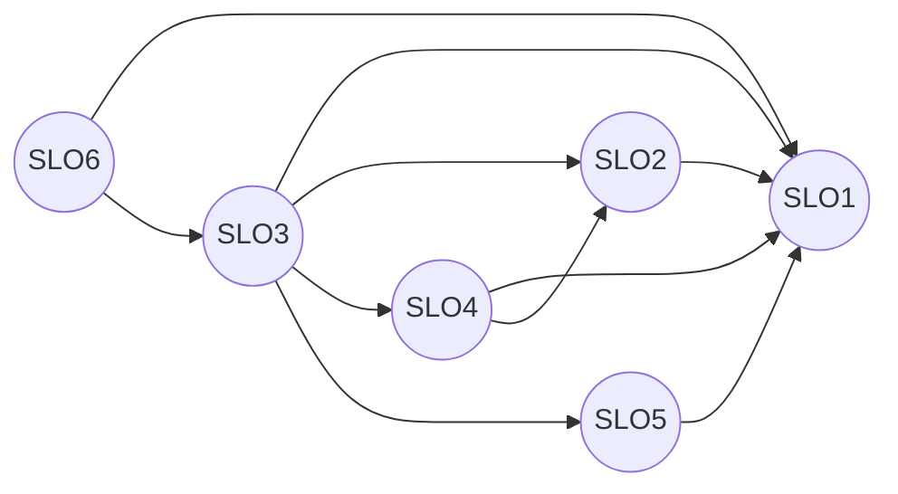
```mermaid
flowchart LR

SLO1((SLO1))
SLO2((SLO2))
SLO3((SLO3))
SLO4((SLO4))
SLO5((SLO5))
SLO6((SLO6))

SLO2 --> SLO1
SLO3 --> SLO1
SLO4 --> SLO1
SLO5 --> SLO1
SLO6 --> SLO1

SLO4 --> SLO2
SLO3 --> SLO2

SLO6 --> SLO3

SLO3 --> SLO4

SLO3 --> SLO5
```

## **Connectivity Matrix**
| | SLO1 | SLO2 | SLO3 | SLO4 | SLO5 | SLO6 |
| :--- | :--- | :--- | :--- | :--- | :--- | :--- |
| **SLO1** | - | | | | | |
| **SLO2** | 1 | - | | | | |
| **SLO3** | 1 | 1 | - | 1 | 1 | |
| **SLO4** | 1 | 1 | | - | | |
| **SLO5** | 1 | | | | - | |
| **SLO6** | 1 | 3 | 1 | 2 | 2 | - |
