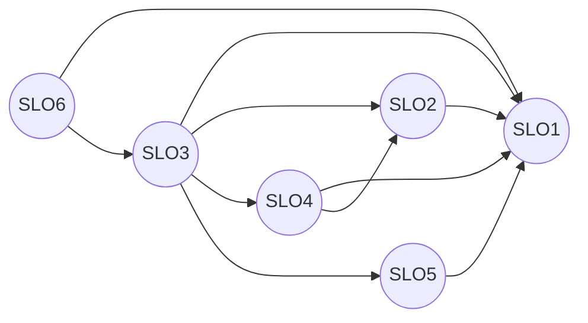

# **Impact Analysis**

## **Traceability Graph**

## **Traceability Graph (Affected by changes)**

## **Directed Graph of SLOs**
SLO1: Authentication Module
SLO2: Customers Module
SLO3: Orders Module
SLO4: Payments Module
SLO5: Restaurants Module
SLO6: Riders Module

## **Connectivity Matrix**
| | SLO1 | SLO2 | SLO3 | SLO4 | SLO5 | SLO6 |
| :--- | :--- | :--- | :--- | :--- | :--- | :--- |
| **SLO1** | - | | | | | |
| **SLO2** | 1 | - | | | | |
| **SLO3** | 1 | 1 | - | 1 | 1 | |
| **SLO4** | 1 | 1 | | - | | |
| **SLO5** | 1 | | | | - | |
| **SLO6** | 1 | 3 | 1 | 2 | 2 | - |
