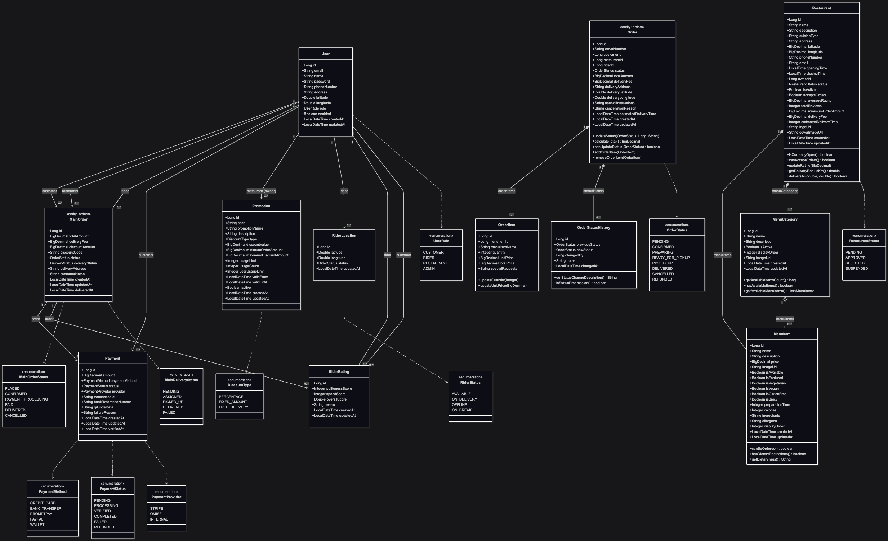

# MharRuengSang's landscape

Generated by [IcePanel](https://icepanel.io/?utm_source=icepanel&utm_medium=pdf_export_header&utm_campaign=icepanel_export) at 2026-02-26 14:26:12

  

## Table of contents

- [1. Context diagrams](#1.-context-diagrams)

    - [1.1. Context Diagram](#1.1.-context-diagram)

- [2. App diagrams](#2.-app-diagrams)

    - [2.1. Food Delivery Platform App Diagram](#2.1.-food-delivery-platform-app-diagram)

- [3. Component diagrams](#3.-component-diagrams)

    - [3.1. Customer Service. Component Diagram](#3.1.-customer-service.-component-diagram)

    - [3.2. Order Management Service. Component Diagram](#3.2.-order-management-service.-component-diagram)

    - [3.3. Payment Service. Component Diagram](#3.3.-payment-service.-component-diagram)

    - [3.4. Restaurant Service. Component Diagram](#3.4.-restaurant-service.-component-diagram)

- [4. Actors](#4.-actors)

    - [4.1. Customer](#4.1.-customer)

    - [4.2. Restaurant](#4.2.-restaurant)

    - [4.3. Rider](#4.3.-rider)

    - [4.4. System Admin](#4.4.-system-admin)

- [5. Groups](#5.-groups)

    - [5.1. Business Logic Layer](#5.1.-business-logic-layer)

    - [5.2. Data Access Layer](#5.2.-data-access-layer)

    - [5.3. Payment Processing Service](#5.3.-payment-processing-service)

    - [5.4. REST API Controllers](#5.4.-rest-api-controllers)

- [6. Systems](#6.-systems)

    - [6.1. Food Delivery Platform](#6.1.-food-delivery-platform)

    - [6.2. Maps/Location Service](#6.2.-maps/location-service)

    - [6.3. OTP/SMS Servicedํ](#6.3.-otp/sms-servicedํ)

    - [6.4. Payment Gateway](#6.4.-payment-gateway)

- [7. Apps](#7.-apps)

    - [7.1. Admin Service.](#7.1.-admin-service.)

    - [7.2. API Gateway](#7.2.-api-gateway)

    - [7.3. Authentication & Security Service](#7.3.-authentication-&-security-service)

    - [7.4. Customer Service.](#7.4.-customer-service.)

    - [7.5. Mobile app](#7.5.-mobile-app)

    - [7.6. Order Management Service.](#7.6.-order-management-service.)

    - [7.7. Payment Service.](#7.7.-payment-service.)

    - [7.8. Restaurant Service.](#7.8.-restaurant-service.)

    - [7.9. Rider Service.](#7.9.-rider-service.)

    - [7.10. Web app](#7.10.-web-app)

- [8. Stores](#8.-stores)

    - [8.1. Message Queue](#8.1.-message-queue)

    - [8.2. PostgreSQL](#8.2.-postgresql)

    - [8.3. Redis Cache](#8.3.-redis-cache)

- [9. Components](#9.-components)

    - [9.1. Commission Calculator](#9.1.-commission-calculator)

    - [9.2. Credit Card Strategy](#9.2.-credit-card-strategy)

    - [9.3. Customer Controller](#9.3.-customer-controller)

    - [9.4. Customer Repositary(JPA)](#9.4.-customer-repositary(jpa))

    - [9.5. Customer Repository](#9.5.-customer-repository)

    - [9.6. Customer Service](#9.6.-customer-service)

    - [9.7. Event Publisher](#9.7.-event-publisher)

    - [9.8. Menu Controller](#9.8.-menu-controller)

    - [9.9. Menu Service](#9.9.-menu-service)

    - [9.10. Order Controller](#9.10.-order-controller)

    - [9.11. Order Controller](#9.11.-order-controller)

    - [9.12. Order Orchestration Controller](#9.12.-order-orchestration-controller)

    - [9.13. Order Repositary(JPA)](#9.13.-order-repositary(jpa))

    - [9.14. Order Respository](#9.14.-order-respository)

    - [9.15. Order Respository (JPA)](#9.15.-order-respository-(jpa))

    - [9.16. Order Service](#9.16.-order-service)

    - [9.17. Order Service](#9.17.-order-service)

    - [9.18. Order State Machine](#9.18.-order-state-machine)

    - [9.19. Payment Controller](#9.19.-payment-controller)

    - [9.20. Payment Gateway Integration](#9.20.-payment-gateway-integration)

    - [9.21. Payment Strategy Interface](#9.21.-payment-strategy-interface)

    - [9.22. Promotion Controller](#9.22.-promotion-controller)

    - [9.23. Promotion Repositary(JPA)](#9.23.-promotion-repositary(jpa))

    - [9.24. QR Code/PromptPay Strategy](#9.24.-qr-code/promptpay-strategy)

    - [9.25. Rating Controller](#9.25.-rating-controller)

    - [9.26. Rating Repository](#9.26.-rating-repository)

    - [9.27. Rating Service](#9.27.-rating-service)

    - [9.28. Rating Service](#9.28.-rating-service)

    - [9.29. Transaction Repositary](#9.29.-transaction-repositary)

## 1. Context diagrams

#### 1.1. Context Diagram

Context diagram in the Default domain domain.

## 2. App diagrams

#### 2.1. Food Delivery Platform App Diagram

Food Delivery Platform app diagram in the Default domain domain.

## 3. Component diagrams

#### 3.1. Customer Service. Component Diagram

Customer Service. component diagram in the Default domain domain.

#### 3.2. Order Management Service. Component Diagram

Order Management Service. component diagram in the Default domain domain.

#### 3.3. Payment Service. Component Diagram

Payment Service. component diagram in the Default domain domain.

#### 3.4. Restaurant Service. Component Diagram

Restaurant Service. component diagram in the Default domain domain.

## 4. Actors

#### 4.1. Customer

Internal actor in the Default domain domain.

Status: live

- Browse     - Order
- Pay             - Rate

**In diagrams**:

- [Context Diagram](#1.1.-context-diagram)

 

#### 4.2. Restaurant

Internal actor in the Default domain domain.

Status: live

- Manage Menu
- View Orders

**In diagrams**:

- [Context Diagram](#1.1.-context-diagram)

 

#### 4.3. Rider

Internal actor in the Default domain domain.

Status: live

- Accept Orders
- Deliver

**In diagrams**:

- [Context Diagram](#1.1.-context-diagram)

 

#### 4.4. System Admin

Internal actor in the Default domain domain.

Status: live

- Monitor Revenue
- Manage Accounts
- Create Promos

**In diagrams**:

- [Context Diagram](#1.1.-context-diagram)

 

## 5. Groups

#### 5.1. Business Logic Layer

Internal group in the Default domain domain.

Status: live

**In diagrams**:

- [Customer Service. Component Diagram](#3.1.-customer-service.-component-diagram)

- [Restaurant Service. Component Diagram](#3.4.-restaurant-service.-component-diagram)

 

#### 5.2. Data Access Layer

Internal group in the Default domain domain.

Status: live

**In diagrams**:

- [Customer Service. Component Diagram](#3.1.-customer-service.-component-diagram)

- [Restaurant Service. Component Diagram](#3.4.-restaurant-service.-component-diagram)

 

#### 5.3. Payment Processing Service

Internal group in the Default domain domain.

Status: live

**In diagrams**:

- [Payment Service. Component Diagram](#3.3.-payment-service.-component-diagram)

 

#### 5.4. REST API Controllers

Internal group in the Default domain domain.

Status: live

**In diagrams**:

- [Customer Service. Component Diagram](#3.1.-customer-service.-component-diagram)

- [Restaurant Service. Component Diagram](#3.4.-restaurant-service.-component-diagram)

 

## 6. Systems

#### 6.1. Food Delivery Platform

Internal system in the Default domain domain.

Status: live

-Order Management
-Payment Processing
-User Management
-Commission 10%

**Technologies**:

- [Spring Boot](https://spring.io/projects/spring-boot#learn)

**In diagrams**:

- [Context Diagram](#1.1.-context-diagram)

- [Food Delivery Platform App Diagram](#2.1.-food-delivery-platform-app-diagram)

 

#### 6.2. Maps/Location Service

Internal system in the Default domain domain.

Status: live

- Distance
- Navigation

**Technologies**:

- [Google Maps Platform](undefined)

**In diagrams**:

- [Context Diagram](#1.1.-context-diagram)

- [Food Delivery Platform App Diagram](#2.1.-food-delivery-platform-app-diagram)

 

#### 6.3. OTP/SMS Servicedํ

Internal system in the Default domain domain.

Status: live

- Send OPT
- Verify

**Technologies**:

- [Twilio](https://www.twilio.com/docs)

**In diagrams**:

- [Context Diagram](#1.1.-context-diagram)

- [Food Delivery Platform App Diagram](#2.1.-food-delivery-platform-app-diagram)

 

#### 6.4. Payment Gateway

Internal system in the Default domain domain.

Status: live

- Credit Card
- QR Pay

**In diagrams**:

- [Context Diagram](#1.1.-context-diagram)

- [Food Delivery Platform App Diagram](#2.1.-food-delivery-platform-app-diagram)

 

## 7. Apps

#### 7.1. Admin Service.

Internal app in the Default domain domain.

Status: live

- Revenue tracking
- account management
- system promotions

**Technologies**:

- [Spring Boot](https://spring.io/projects/spring-boot#learn)

**In diagrams**:

- [Food Delivery Platform App Diagram](#2.1.-food-delivery-platform-app-diagram)

 

#### 7.2. API Gateway

Internal app in the Default domain domain.

Status: live

- Routing
- Load Balancing
- Rate Limiting
 - Authentication

**Technologies**:

- [Spring Cloud Gateway](https://docs.spring.io/spring-cloud-gateway/docs/current/reference/html/)

**In diagrams**:

- [Food Delivery Platform App Diagram](#2.1.-food-delivery-platform-app-diagram)

 

#### 7.3. Authentication & Security Service

Internal app in the Default domain domain.

Status: live

- OTP Verification
- Password Policy
- JWT Token Management

**Technologies**:

- [OAuth 2.0](https://oauth.net/2/)

**In diagrams**:

- [Food Delivery Platform App Diagram](#2.1.-food-delivery-platform-app-diagram)

 

#### 7.4. Customer Service.

Internal app in the Default domain domain.

Status: live

- Orders
- Manages customer profiles
- Ratings

**Technologies**:

- [Spring Boot](https://spring.io/projects/spring-boot#learn)

**In diagrams**:

- [Customer Service. Component Diagram](#3.1.-customer-service.-component-diagram)

- [Food Delivery Platform App Diagram](#2.1.-food-delivery-platform-app-diagram)

 

#### 7.5. Mobile app

Internal app in the Default domain domain.

Status: live

- React Native/Flutter
- Native Features

**Technologies**:

- [Android](undefined)

- [Apple iOS](https://developer.apple.com/ios/resources/)

**In diagrams**:

- [Food Delivery Platform App Diagram](#2.1.-food-delivery-platform-app-diagram)

 

#### 7.6. Order Management Service.

Internal app in the Default domain domain.

Status: live

- Manage order workflow and status

**Technologies**:

- [Spring Boot](https://spring.io/projects/spring-boot#learn)

**In diagrams**:

- [Food Delivery Platform App Diagram](#2.1.-food-delivery-platform-app-diagram)

- [Order Management Service. Component Diagram](#3.2.-order-management-service.-component-diagram)

 

#### 7.7. Payment Service.

Internal app in the Default domain domain.

Status: live

- Processes payments
- 10% commission

**Technologies**:

- [Spring Boot](https://spring.io/projects/spring-boot#learn)

**In diagrams**:

- [Food Delivery Platform App Diagram](#2.1.-food-delivery-platform-app-diagram)

- [Payment Service. Component Diagram](#3.3.-payment-service.-component-diagram)

 

#### 7.8. Restaurant Service.

Internal app in the Default domain domain.

Status: live

- Menu Management
- Order reception
- Promotions

**Technologies**:

- [Spring Boot](https://spring.io/projects/spring-boot#learn)

**In diagrams**:

- [Food Delivery Platform App Diagram](#2.1.-food-delivery-platform-app-diagram)

- [Restaurant Service. Component Diagram](#3.4.-restaurant-service.-component-diagram)

 

#### 7.9. Rider Service.

Internal app in the Default domain domain.

Status: live

- Delivery  assignments
- Location tracking

**Technologies**:

- [Spring Boot](https://spring.io/projects/spring-boot#learn)

**In diagrams**:

- [Food Delivery Platform App Diagram](#2.1.-food-delivery-platform-app-diagram)

 

#### 7.10. Web app

Internal app in the Default domain domain.

Status: live

- ReactJS/Angular
- Responsive UI
- All Browsers

**In diagrams**:

- [Food Delivery Platform App Diagram](#2.1.-food-delivery-platform-app-diagram)

 

## 8. Stores

#### 8.1. Message Queue

Internal store in the Default domain domain.

Status: live

- Event Streaming
- Async Processing

**Technologies**:

- [Apache Kafka](https://kafka.apache.org/documentation.html)

**In diagrams**:

- [Food Delivery Platform App Diagram](#2.1.-food-delivery-platform-app-diagram)

 

#### 8.2. PostgreSQL

Internal store in the Default domain domain.

Status: live

Primary relational database

**Technologies**:

- [PostgreSQL](https://www.postgresql.org/docs/current)

**In diagrams**:

- [Customer Service. Component Diagram](#3.1.-customer-service.-component-diagram)

- [Food Delivery Platform App Diagram](#2.1.-food-delivery-platform-app-diagram)

- [Restaurant Service. Component Diagram](#3.4.-restaurant-service.-component-diagram)

 

#### 8.3. Redis Cache

Internal store in the Default domain domain.

Status: live

- sessions
- menus
- location data

**In diagrams**:

- [Food Delivery Platform App Diagram](#2.1.-food-delivery-platform-app-diagram)

- [Restaurant Service. Component Diagram](#3.4.-restaurant-service.-component-diagram)

 

## 9. Components

#### 9.1. Commission Calculator

Internal component in the Default domain domain.

Status: live

- Calculate platformFee
- Calculate RestaurantAmount
- Apply PromotionDiscount

**In diagrams**:

- [Payment Service. Component Diagram](#3.3.-payment-service.-component-diagram)

 

#### 9.2. Credit Card Strategy

Internal component in the Default domain domain.

Status: live

- Validate card
- Call gateway

**In groups**:

- [Payment Processing Service](#5.3.-payment-processing-service)

**In diagrams**:

- [Payment Service. Component Diagram](#3.3.-payment-service.-component-diagram)

 

#### 9.3. Customer Controller

Internal component in the Default domain domain.

Status: live

- Register 
- Login
- Update Profile

**In groups**:

- [REST API Controllers](#5.4.-rest-api-controllers)

**In diagrams**:

- [Customer Service. Component Diagram](#3.1.-customer-service.-component-diagram)

 

#### 9.4. Customer Repositary(JPA)

Internal component in the Default domain domain.

Status: live

**In groups**:

- [Data Access Layer](#5.2.-data-access-layer)

**In diagrams**:

- [Restaurant Service. Component Diagram](#3.4.-restaurant-service.-component-diagram)

 

#### 9.5. Customer Repository

Internal component in the Default domain domain.

Status: live

- CRUD
- Queries

**In groups**:

- [Data Access Layer](#5.2.-data-access-layer)

**In diagrams**:

- [Customer Service. Component Diagram](#3.1.-customer-service.-component-diagram)

 

#### 9.6. Customer Service

Internal component in the Default domain domain.

Status: live

- Validate
- Business rules

**In groups**:

- [Business Logic Layer](#5.1.-business-logic-layer)

**In diagrams**:

- [Customer Service. Component Diagram](#3.1.-customer-service.-component-diagram)

 

#### 9.7. Event Publisher

Internal component in the Default domain domain.

Status: live

- Create order
- Confirm order
- Notify order ready
- Deliver order

**In diagrams**:

- [Order Management Service. Component Diagram](#3.2.-order-management-service.-component-diagram)

 

#### 9.8. Menu Controller

Internal component in the Default domain domain.

Status: live

- Add Item
- Update
- Delete
- Update price

**In groups**:

- [REST API Controllers](#5.4.-rest-api-controllers)

**In diagrams**:

- [Restaurant Service. Component Diagram](#3.4.-restaurant-service.-component-diagram)

 

#### 9.9. Menu Service

Internal component in the Default domain domain.

Status: live

- Validate Menu
- Cache Update

**In groups**:

- [Business Logic Layer](#5.1.-business-logic-layer)

**In diagrams**:

- [Restaurant Service. Component Diagram](#3.4.-restaurant-service.-component-diagram)

 

#### 9.10. Order Controller

Internal component in the Default domain domain.

Status: live

- Create  
- View
- Cancel

**In groups**:

- [REST API Controllers](#5.4.-rest-api-controllers)

**In diagrams**:

- [Customer Service. Component Diagram](#3.1.-customer-service.-component-diagram)

 

#### 9.11. Order Controller

Internal component in the Default domain domain.

Status: live

- View
- Accept
- Complete

**In groups**:

- [REST API Controllers](#5.4.-rest-api-controllers)

**In diagrams**:

- [Restaurant Service. Component Diagram](#3.4.-restaurant-service.-component-diagram)

 

#### 9.12. Order Orchestration Controller

Internal component in the Default domain domain.

Status: live

- Create Order  
- Update Order Status
- Track Order

**In diagrams**:

- [Order Management Service. Component Diagram](#3.2.-order-management-service.-component-diagram)

 

#### 9.13. Order Repositary(JPA)

Internal component in the Default domain domain.

Status: live

**In groups**:

- [Data Access Layer](#5.2.-data-access-layer)

**In diagrams**:

- [Restaurant Service. Component Diagram](#3.4.-restaurant-service.-component-diagram)

 

#### 9.14. Order Respository

Internal component in the Default domain domain.

Status: live

- CRUD
- Queries

**In groups**:

- [Data Access Layer](#5.2.-data-access-layer)

**In diagrams**:

- [Customer Service. Component Diagram](#3.1.-customer-service.-component-diagram)

 

#### 9.15. Order Respository (JPA)

Internal component in the Default domain domain.

Status: live

- Save
- find By Id
- find By Customer Id
- find By Restaurant Id
- find By Status

**In diagrams**:

- [Order Management Service. Component Diagram](#3.2.-order-management-service.-component-diagram)

 

#### 9.16. Order Service

Internal component in the Default domain domain.

Status: live

- Calculate Total
- Apply Promotion

**In groups**:

- [Business Logic Layer](#5.1.-business-logic-layer)

**In diagrams**:

- [Customer Service. Component Diagram](#3.1.-customer-service.-component-diagram)

 

#### 9.17. Order Service

Internal component in the Default domain domain.

Status: live

- Notify kitchen
- Update status

**In groups**:

- [Business Logic Layer](#5.1.-business-logic-layer)

**In diagrams**:

- [Restaurant Service. Component Diagram](#3.4.-restaurant-service.-component-diagram)

 

#### 9.18. Order State Machine

Internal component in the Default domain domain.

Status: live

- Validate order
- Confirm payment
- Notify restaurant
- Assign rider
- Confirm delivery

**In diagrams**:

- [Order Management Service. Component Diagram](#3.2.-order-management-service.-component-diagram)

 

#### 9.19. Payment Controller

Internal component in the Default domain domain.

Status: live

- Process payment
- Verify payment
- Refund payment

**In diagrams**:

- [Payment Service. Component Diagram](#3.3.-payment-service.-component-diagram)

 

#### 9.20. Payment Gateway Integration

Internal component in the Default domain domain.

Status: live

- External API Clients
- Retry Logic
- Webhook Handlers

**In diagrams**:

- [Payment Service. Component Diagram](#3.3.-payment-service.-component-diagram)

 

#### 9.21. Payment Strategy Interface

Internal component in the Default domain domain.

Status: live

- Process payment
- Verify payment
- Refund payment

**In groups**:

- [Payment Processing Service](#5.3.-payment-processing-service)

**In diagrams**:

- [Payment Service. Component Diagram](#3.3.-payment-service.-component-diagram)

 

#### 9.22. Promotion Controller

Internal component in the Default domain domain.

Status: live

- Create
- Update
- Delete

**In groups**:

- [REST API Controllers](#5.4.-rest-api-controllers)

**In diagrams**:

- [Restaurant Service. Component Diagram](#3.4.-restaurant-service.-component-diagram)

 

#### 9.23. Promotion Repositary(JPA)

Internal component in the Default domain domain.

Status: live

**In groups**:

- [Data Access Layer](#5.2.-data-access-layer)

**In diagrams**:

- [Restaurant Service. Component Diagram](#3.4.-restaurant-service.-component-diagram)

 

#### 9.24. QR Code/PromptPay Strategy

Internal component in the Default domain domain.

Status: live

- Generate QR
- Verify

**In groups**:

- [Payment Processing Service](#5.3.-payment-processing-service)

**In diagrams**:

- [Payment Service. Component Diagram](#3.3.-payment-service.-component-diagram)

 

#### 9.25. Rating Controller

Internal component in the Default domain domain.

Status: live

- Submit rating
- View rating

**In groups**:

- [REST API Controllers](#5.4.-rest-api-controllers)

**In diagrams**:

- [Customer Service. Component Diagram](#3.1.-customer-service.-component-diagram)

 

#### 9.26. Rating Repository

Internal component in the Default domain domain.

Status: live

- CRUD
- Queries

**In groups**:

- [Data Access Layer](#5.2.-data-access-layer)

**In diagrams**:

- [Customer Service. Component Diagram](#3.1.-customer-service.-component-diagram)

 

#### 9.27. Rating Service

Internal component in the Default domain domain.

Status: live

- Validate rating
- Average rating

**In groups**:

- [Business Logic Layer](#5.1.-business-logic-layer)

**In diagrams**:

- [Customer Service. Component Diagram](#3.1.-customer-service.-component-diagram)

 

#### 9.28. Rating Service

Internal component in the Default domain domain.

Status: live

- Validate Promotion
- Calculate discount

**In groups**:

- [Business Logic Layer](#5.1.-business-logic-layer)

**In diagrams**:

- [Restaurant Service. Component Diagram](#3.4.-restaurant-service.-component-diagram)

 

#### 9.29. Transaction Repositary

Internal component in the Default domain domain.

Status: live

- Save transaction
- FindByOrderId
- FfindByStatus

**In diagrams**:

- [Payment Service. Component Diagram](#3.3.-payment-service.-component-diagram)

 

## Class Diagram
