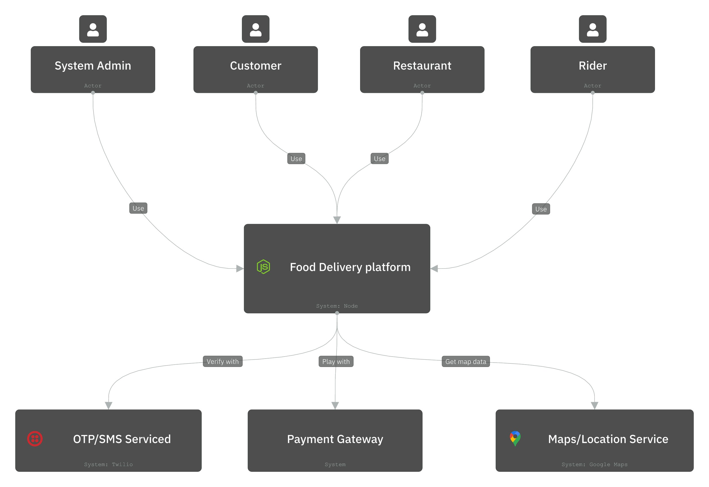

# HANDOVER

## 1. Features of the Received Project
The received project is a food delivery platform called `MharRuengSang`. Based on the repository contents, it is intended to support four main user roles:
- Customer
- Restaurant
- Rider
- Admin

The main features of the project include:
#### Customer Features:
- Register/Login With OTP
- Browse restaurants, including cuisine types and distance
- Order food and make payment (With Card/ QR Code/ PromptPay)
- Rate riders
#### Restaurant Features:
- Manage Menu (Add,Delete,Update Menu items, Edit price)
- Receive/View orders
- Create restaurant-specific promotions
#### Rider features:
- View and accept order
- Access customer address
- Confirm delivery 
#### Admin features:
- Manage users including enable/disable accounts
- Monitor revenue
- Create system promotions
#### System features:
- Multi-factor authentication (OTP)
- Support up to 10 millions users

The implemented features are split across a React frontend and a Spring Boot backend

## 2. Verification of the Design Against the Actual Implementation
Implemented system has:
- Frontend (React + Vite) running on port 5173
- API Gateway on port 8080
- Order Service on port 8081
- Restaurant Service on port 8082
- PostgreSQL database
- Two separate databases

### Context Diagram
Context Diagram: They really provide user roles as in the implementation

Updated:

### Container Diagram
App Diagram: Mobile app module is missing. API Gateway, Restaurant, Order management are found but in different names. While other services like Customer, Rider, Admin are found hidden in different places, it is a bit hard to track which reduces consistency. Databases are found as well including cache.

### Component Diagrams
3.1 Customer Service: Customer Service is missing but found as UserService. Which manages all users, not just customers. UserService covers all email, phone and validate and update profile(src/main/java/entity/User) but cannot delete. Covers customer’s submit and view specific rider rating, average rating and specific order 

3.2 Order Management Service: Found as OrderService, there are several name inconsistencies, but the mechanism is the same as implementation.

3.3 Payment Service: Payment modules are in several places and workflows are not consistent in the implementation. Credit Card is found in the payment gateway module which contains other payments as well.

3.4 Restaurant Service: Promotion Controller(main/controller/promotioncontroller) covers all create, update, delete but cannot calculate discount and customer also cannot enter code. For Menu controller(restaurant-service) covers all CRUD

There are some modules that were not mentioned in the C4 diagram, but appear on the implementation. There are also components that appear on the C4 diagram, but not in the implementation. There are components that were in the higher hierarchy but disappear in the lower diagrams. Overall, the diagram is quite inconsistent especially in payment components, but the consistency from the components diagram to implementation is okay despite some naming inconsistencies.

## 3. Reflections on Receiving the Handover Project

### a. What technologies are used?
From the real codebase, the project uses:
- Java 17+
- Node.js 18+
- Tailwind CSS
- Java Spring Boot (Backend) 
- Maven 3.9+ (Build tool)
- React + Vite (Frontend)
- PostgreSQL (Database)
- SonarQube configuration files and report artifacts

### b. What information is required to successfully hand over the project?
- Installation & Run Instructions
- Window command
- Database Configuration
- API documentation

### c. What is the code quality of the handover project (by running SonarQube)?
- Does not meet the required code quality standard, Only 33% is tested.

- The test coverage is too low, suggesting that there should be more tests to cover all core logic. Code duplication rate is good. There is no blocker and high severity issue.

